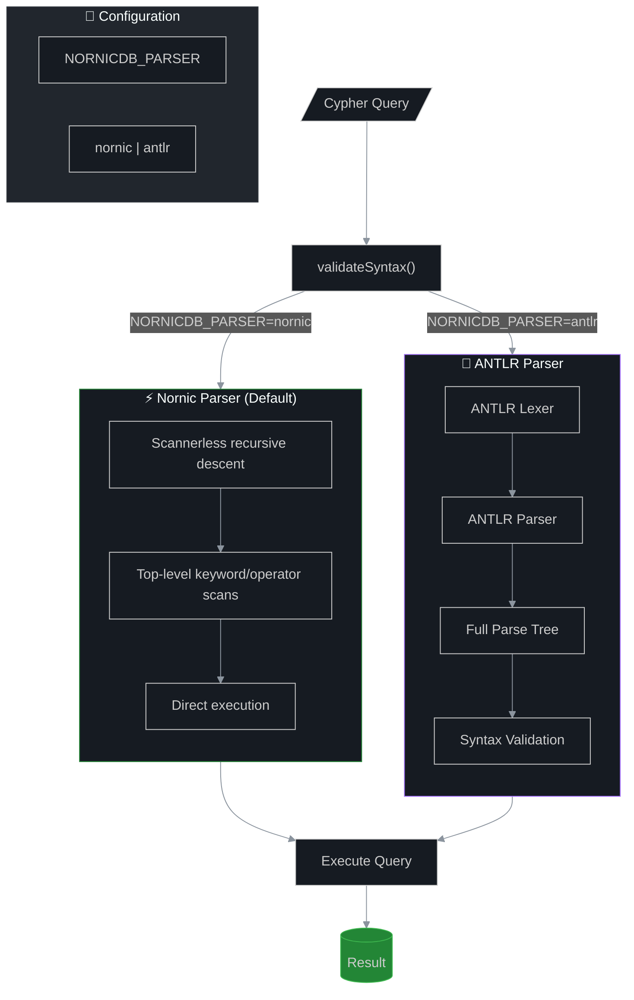

# Cypher Parser Modes

> **Environment Variable:** `NORNICDB_PARSER`  
> **Options:** `nornic` (default) | `antlr`

NornicDB supports two Cypher parser implementations that can be switched at runtime.

## Architecture


```mermaid
%%{init: {'theme': 'dark', 'themeVariables': { 'primaryColor': '#1f6feb', 'primaryTextColor': '#c9d1d9', 'primaryBorderColor': '#30363d', 'lineColor': '#8b949e', 'secondaryColor': '#238636', 'tertiaryColor': '#21262d', 'background': '#0d1117', 'mainBkg': '#161b22'}}}%%

flowchart TB
    subgraph ENV["🔧 Configuration"]
        direction LR
        E1["NORNICDB_PARSER"]
        E2["nornic | antlr"]
    end

    Q[/"Cypher Query"/]
    
    Q --> VALIDATE["validateSyntax()"]
    
    VALIDATE --> |"NORNICDB_PARSER=nornic"| NORNIC
    VALIDATE --> |"NORNICDB_PARSER=antlr"| ANTLR
    
    subgraph NORNIC["⚡ Nornic Parser (Default)"]
        direction TB
        N1["Scannerless recursive descent"]
        N2["Top-level keyword/operator scans"]
        N3["Direct execution"]
        N1 --> N2 --> N3
    end
    
    subgraph ANTLR["🌳 ANTLR Parser"]
        direction TB
        A1["ANTLR Lexer"]
        A2["ANTLR Parser"]
        A3["Full Parse Tree"]
        A4["Syntax Validation"]
        A1 --> A2 --> A3 --> A4
    end
    
    NORNIC --> EXEC["Execute Query"]
    ANTLR --> EXEC
    EXEC --> RESULT[("Result")]
    
    style ENV fill:#21262d,stroke:#30363d
    style NORNIC fill:#161b22,stroke:#238636
    style ANTLR fill:#161b22,stroke:#a371f7
    style RESULT fill:#238636,stroke:#3fb950
```

## Real-World Benchmarks (Northwind Database)

| Query | ⚡ Nornic | 🌳 ANTLR | Slowdown |
|-------|----------|----------|----------|
| Count all nodes | 3,272 hz | 45 hz | **73x** |
| Count all relationships | 3,693 hz | 50 hz | **74x** |
| Find customer by ID | 4,213 hz | 2,153 hz | 2x |
| Products supplied by supplier | 4,023 hz | 53 hz | **76x** |
| Supplier→Category traversal | 3,225 hz | 22 hz | **147x** |
| Products with/without orders | 3,881 hz | 0.82 hz | **4,753x** |
| Create/delete relationship | 3,974 hz | 62 hz | **64x** |

**Total test suite time:**
| Mode | Time |
|------|------|
| ⚡ Nornic | 17.5s |
| 🌳 ANTLR | 35.3s (2x slower) |

## Mode Comparison

| Feature | ⚡ Nornic (Default) | 🌳 ANTLR |
|---------|---------------------|----------|
| **Throughput** | 3,000-4,200 ops/sec | 0.8-2,100 ops/sec |
| **Worst Case** | - | **4,753x slower** |
| **Error Messages** | Classified with restored line/column positions | Detailed (line/column) |
| **Syntax Validation** | Strict, TCK-vetted (see below) | Strict OpenCypher |
| **Memory Usage** | Lowest (scannerless recursive descent, no parse tree) | Higher |
| **Best For** | **Production** | Development/Debugging |

> **Note:** both modes share a single converged execution pipeline. There are no
> legacy alternate executors or text re-dispatch fallbacks: every statement runs
> through the same typed router (`Handled` / `NotApplicable` / `ParseRejected` /
> `Failed`), and unhandled statements fail with Neo4j's `Neo.ClientError.Statement.SyntaxError`
> classification rather than being re-routed.

### Nornic validation is TCK-vetted

The Nornic parser is a **scannerless recursive descent parser**: it descends over
the raw query text with no separate lexer, and precedence is handled by recursive
splitting at the top-level occurrence of each operator (`findTopLevelOperator`,
`pkg/cypher/operators.go`), with quote/comment/bracket-aware fragment consumption
shared by all callers (`pkg/cypher/keyword_scan.go`). The official OpenCypher TCK is pinned at
revision `370fe27f` and the ratchet records **7794/7794 scenario/mode outcomes
passing** with zero expected gaps, setup blocks or harness errors
(`make cypher-tck-ratchet`, `make cypher-tck-vetted`). Rejections are classified
with Neo4j Bolt status codes and error positions are restored from the original
query text, including CR/CRLF/LF line counting.

## Configuration

```bash
# Production (default) - fastest
export NORNICDB_PARSER=nornic

# Development/Debugging - strict validation, better errors
export NORNICDB_PARSER=antlr
```

## Programmatic Switching

```go
import "github.com/orneryd/nornicdb/pkg/config"

// Check current parser
if config.IsNornicParser() {
    // Using fast Nornic parser
}

// Switch to ANTLR temporarily
cleanup := config.WithANTLRParser()
defer cleanup()
// ... queries use ANTLR parser here

// Direct set
config.SetParserType(config.ParserTypeANTLR)
config.SetParserType(config.ParserTypeNornic)
```

## When to Use Each Parser

### ⚡ Nornic Parser (`NORNICDB_PARSER=nornic`) — **Default**

**Use when:**
- Production deployments
- Maximum performance is critical
- Simple, well-tested query patterns
- High-throughput workloads

**Pros:**
- **Fastest execution** — 3,000-4,200 ops/sec
- 💾 **Lowest memory** — No parse tree allocation
- 🔧 **Battle-tested** — Original implementation, converged single pipeline
- ⚡ **Zero parsing overhead** — scannerless recursive descent, no lexer or parse tree

**Cons:**
- 🐛 **No structured parse tree** — debugging uses restored positions, not AST inspection
- 📝 **Semantic scope checks** are clause-targeted rather than grammar-derived; the TCK ratchet gates the supported surface

---

### 🌳 ANTLR Parser (`NORNICDB_PARSER=antlr`)

**Use when:**
- Development and debugging
- Need detailed syntax error messages
- Strict OpenCypher compliance required
- Building query analysis tools

**Pros:**
- ✅ **Strict validation** — Full OpenCypher grammar
- 📍 **Detailed errors** — Line and column numbers
- 🌳 **Full parse tree** — For analysis/tooling
- 🛠️ **Extensible** — Easy to add new features

**Cons:**
- 🐢 **Much slower** — 50-5000x slower than Nornic
- 💾 **Higher memory** — Full parse tree allocation
- ⏱️ **Not for production** — Too slow for high-throughput

## Error Message Comparison

**Invalid query:** `MATCH (n RETURN n` (missing closing paren)

| Parser | Error Message |
|--------|---------------|
| Nornic | `syntax error: unbalanced parentheses` classified as `Neo.ClientError.Statement.SyntaxError` (offset-tracked errors additionally restore line/column positions from the original query text) |
| ANTLR | `syntax error: line 1:9 no viable alternative at input 'MATCH (n RETURN'` |

## Make Targets

```bash
# Run entire test suite with ANTLR parser
make antlr-test

# Run cypher tests with both parsers
make test-parsers

# Regenerate ANTLR parser from grammar
make antlr-generate
```

## Files

| File | Description |
|------|-------------|
| `pkg/config/feature_flags.go` | Parser type configuration |
| `pkg/cypher/executor.go` | `validateSyntax()` dispatcher |
| `pkg/cypher/antlr/` | ANTLR parser implementation |
| `pkg/cypher/antlr/*.g4` | ANTLR grammar files |

---

**TL;DR:** Use `nornic` (default) for production. Use `antlr` only for development/debugging when you need detailed error messages.
