# Knowledge-Policy Scoring Pipeline (Pre-Visibility)

**End-to-end architecture of NornicDB's knowledge-policy scoring stage, from a read-path entry point through the compiled binding lookup, decay/promotion math, and suppression decision — right up to the hand-off to the Visibility Layer.**

This document diagrams the code as it exists in the repository. Every stage in the flowchart maps to a specific file and function in `pkg/knowledgepolicy/` and `pkg/storage/badger_decay_filter.go`. See the [Legend](#legend--source-references) below for line-level references.

For the user-facing policy DDL and semantics, see [Knowledge-Layer Policies](../user-guides/knowledge-layer-policies.md). For what happens **after** an entity is marked suppressed, see [Visibility Suppression and Deindex](../user-guides/visibility-suppression-deindex.md).

---

## Full Pipeline

```mermaid
%%{init: {'theme': 'dark', 'themeVariables': { 'primaryColor': '#1f6feb', 'primaryTextColor': '#e6edf3', 'primaryBorderColor': '#30363d', 'lineColor': '#8b949e', 'secondaryColor': '#238636', 'tertiaryColor': '#161b22', 'background': '#0d1117', 'mainBkg': '#161b22'}}}%%

flowchart TD
    Q["Cypher query<br/>read path"] --> RQ{"revealAll?<br/>query reveal bypass"}
    RQ -- yes --> VIS["Visible entity hand-off<br/>emit to result set<br/>record access later"]
    RQ -- no --> BE["BadgerEngine<br/>filterNodeByDecay / filterEdgeByDecay"]

    BE --> ENT["Materialize entity metadata<br/>ID, labels or type, props,<br/>createdAt, updatedAt or versionAt"]
    BE --> AMS["AccessMetaStore<br/>Badger LSM"]
    AMS -->|"GetAccessMeta"| AME["AccessMetaEntry<br/>fixed fields, overflow,<br/>kalman filters"]

    ENT --> NS["extractNamespaceFromID"]
    NS --> SF["getScorerForNamespace<br/>per-tenant Scorer"]
    SF -->|"nil scorer"| EF0{"entity.VisibilitySuppressed?"}
    EF0 -- yes --> DROP0["Drop from result set<br/>reason: explicit_flag"]
    EF0 -- no --> VIS

    SF --> RES["Resolver.ResolveNode / ResolveEdge"]
    RES --> BT["BindingTable<br/>wildNode / wildEdge<br/>label key or edge type"]
    RES --> LM{"exact, subset, or wildcard match?"}
    LM -->|multiple subset matches| CONF["resolveConflict<br/>lowest DecayBinding.Order"]
    LM -->|exact, single subset, or wildcard| CB["CompiledBinding<br/>decay bundle + binding overrides<br/>promotion policy<br/>compiled property and promotion rules"]
    CONF --> CB

    CB --> ND{"cb.NoDecay?"}
    ND -- yes --> NEUT["neutralFor<br/>finalScore = 1.0<br/>noDecay = true"]
    NEUT --> NMET["Scorer metrics<br/>IncScored(no_decay)"]
    NMET --> EF1{"entity.VisibilitySuppressed?"}
    EF1 -- yes --> DROP0
    EF1 -- no --> VIS

    ND -- no --> RA["resolveAnchor<br/>CREATED / VERSION /<br/>LAST_ACCESSED / CUSTOM"]
    AME --> RA
    RA --> AGE["ageNanos = max(now - anchor, 0)"]
    AGE --> CD["computeDecay<br/>exp / linear / step / none<br/>negative half-life inverts"]
    CD --> BS["baseScore"]

    BS --> PROM{"promotion enabled?"}
    PROM -- no --> CFS["computeFinalScore<br/>base * multiplier<br/>apply promo floor and cap<br/>apply decay floor"]
    PROM -- yes --> SPP["selectPromotionProfile<br/>evaluate WHEN predicates<br/>pick highest multiplier,<br/>then highest score floor"]
    AME --> SPP
    ENT --> SPP
    SPP --> CFS

    CFS --> SR["ScoringResolution<br/>finalScore, threshold, floor,<br/>multiplier, suppressionEligible"]
    SR --> SMET["Scorer metrics<br/>IncScored + sampled score<br/>IncSuppression when suppressed"]
    SR --> TH{"suppressionEligible?"}
    TH -- yes --> REASON["reason: score_floor<br/>or below_threshold"]
    REASON --> FMET["Read filter metrics<br/>IncReadFilterDropped"]
    FMET --> DROP1["Drop from result set"]
    TH -- no --> VIS

    VIS --> ACC["AccessAccumulator<br/>per-P sharded ring"]
    ACC -->|"timer or buffer full"| FLUSH["AccessFlusher"]
    FLUSH --> OAM["applyOnAccessMutations<br/>evaluate SET expressions"]
    OAM --> KAL{"mutation uses Kalman?"}
    KAL -- yes --> KF["ProcessKalmanMutation<br/>predict, update, gain"]
    KAL -- no --> MERGE["Merge deltas into fixed fields<br/>access and traversal counters,<br/>timestamps, overflow"]
    KF --> MERGE
    MERGE --> PSUP["evaluatePropertySuppression<br/>scoreEntityProperty per property"]
    PSUP --> EMB{"property suppression changed<br/>and target is not an edge?"}
    EMB -- yes --> EI["EmbedInvalidate"]
    EMB -- no --> WRITE["PutAccessMeta"]
    EI --> WRITE
    WRITE --> AMS
    WRITE --> RECHECK["SuppressionRecheck"]
    RECHECK -->|re-score| BE

    classDef entry fill:#163356,stroke:#58a6ff,color:#e6edf3
    classDef store fill:#2d1b47,stroke:#a371f7,color:#f0e6ff
    classDef resolve fill:#4f3a12,stroke:#d29922,color:#fff8e1
    classDef compute fill:#123d2d,stroke:#3fb950,color:#e6ffed
    classDef decision fill:#55221d,stroke:#ff7b72,color:#ffeceb
    classDef terminal fill:#1f2937,stroke:#8b949e,color:#f0f6fc
    classDef feedback fill:#0f4c5c,stroke:#39c5cf,color:#e6fcff

    class Q,BE,ENT,NS entry
    class AMS,AME,BT store
    class SF,RES,LM,CONF,CB,RA resolve
    class AGE,CD,BS,SPP,CFS,SR,SMET,NMET compute
    class RQ,EF0,EF1,ND,PROM,TH,REASON,KAL,EMB decision
    class VIS,DROP0,DROP1,FMET terminal
    class ACC,FLUSH,OAM,KF,MERGE,PSUP,EI,WRITE,RECHECK feedback
```

---

## Legend — Source References

Every box in the diagram corresponds to a real function in the codebase.

| Diagram box                                                                     | Source                                         |
| ------------------------------------------------------------------------------- | ---------------------------------------------- |
| `filterNodeByDecay` / `filterEdgeByDecay`                                       | `pkg/storage/badger_decay_filter.go:56, 107`   |
| `revealAll` gate & `BeginQueryRevealScope`                                      | `pkg/storage/badger_decay_filter.go:30, 37`    |
| `Resolver.ResolveNode` label-subset walk & conflict resolution                  | `pkg/knowledgepolicy/resolver.go:23, 97, 130`  |
| `BindingTable` (wildNode/wildEdge, sorted-label key)                            | `pkg/knowledgepolicy/compiled_binding.go:39`   |
| `CompiledBinding` (flattened bundle + binding + promotion)                      | `pkg/knowledgepolicy/compiled_binding.go:21`   |
| `Scorer.score` (main scoring path)                                              | `pkg/knowledgepolicy/scorer.go:187`            |
| `resolveAnchor` (CREATED / VERSION / LAST_ACCESSED / CUSTOM)                    | `pkg/knowledgepolicy/scorer.go:316`            |
| `computeDecay` (inverse-in-place via negative half-life)                        | `pkg/knowledgepolicy/scorer.go:355`            |
| `selectPromotionProfile` (WHEN predicate eval)                                  | `pkg/knowledgepolicy/scorer.go:290`            |
| `computeFinalScore` (multiplier + floors + cap)                                 | `pkg/knowledgepolicy/scorer.go:402`            |
| `SuppressionEligible = FinalScore < VisibilityThreshold && !HasNoDecayProperty` | `pkg/knowledgepolicy/scorer.go:271`            |
| Suppression reason classification (`score_floor` vs `below_threshold`)          | `pkg/knowledgepolicy/scorer.go:277–285`        |
| `AccessMetaEntry` (Fixed / Overflow / KalmanFilters)                            | `pkg/knowledgepolicy/access_meta.go:11`        |
| `AccessAccumulator` (P-local sharded)                                           | `pkg/knowledgepolicy/access_accumulator.go:24` |
| `AccessFlusher.applyOnAccessMutations`                                          | `pkg/knowledgepolicy/on_access_runtime.go:9`   |
| `ProcessKalmanMutation` (velocity + gain)                                       | `pkg/knowledgepolicy/kalman_accumulator.go:9`  |
| `SuppressionRecheckFunc` / `EmbedInvalidateFunc` feedback                       | `pkg/knowledgepolicy/access_flusher.go:42, 39` |

---

## Pipeline Stages (Pre-Visibility)

1. **Query entry.** The read path in `BadgerEngine` calls `filterNodeByDecay` / `filterEdgeByDecay`. A `reveal()` scope short-circuits scoring for that query only.
2. **Scorer selection.** The namespace extracted from the entity ID picks a per-tenant `Scorer`. If none exists, the explicit `VisibilitySuppressed` flag is honored (and counted as `explicit_flag` in metrics).
3. **Resolver.** Sorted-label subset walk against `BindingTable`; ties are resolved by lowest `DecayBinding.Order`; wildcard fallback for unmatched labels or edge types.
4. **CompiledBinding.** Pre-flattened bundle + binding overrides + promotion policy + property rules + compiled WHEN predicates. `NoDecay` short-circuits to a neutral score of `1.0` with `NoDecay=true`; the read filter still honors an explicit `VisibilitySuppressed` flag for those entities.
5. **Anchor + age.** `resolveAnchor` picks the start time (CREATED / VERSION / LAST_ACCESSED / CUSTOM). Age is `now − anchor`, clamped to zero.
6. **Base decay.** Exponential, linear, step, or none. A negative `HalfLifeNanos` inverts the curve in place (`1 − f`) — this is how idle-time consolidation is implemented, without adding new function/type/flag values to the schema.
7. **Promotion.** WHEN predicates are evaluated over `AccessMetaEntry` + entity properties; the profile with the highest `Multiplier` (then `ScoreFloor`) wins.
8. **Final score.** `base × multiplier`, clamped by `[promoFloor, promoCap]`, then floored by `DecayFloor`.
9. **Suppression decision.** `FinalScore < VisibilityThreshold && !HasNoDecayProperty` sets `SuppressionEligible=true`; the scorer classifies the reason as `score_floor` or `below_threshold`, and the read filter drops the entity from the result set.
10. **Access feedback (out of band).** Surviving entities feed the `AccessAccumulator`, drained by `AccessFlusher`, which applies `ON ACCESS` mutations (optionally through the Kalman filter), merges fixed-field deltas, re-evaluates property suppression, optionally calls `EmbedInvalidate` when property suppression state changes, persists `AccessMetaEntry`, and finally triggers `SuppressionRecheck`.

---

## What This Diagram Excludes

Everything **downstream of `SuppressionEligible`** — the Visibility Layer itself — is out of scope for this document. That includes:

- BM25 and vector-index deindex work items
- `reveal()` bypass semantics from a caller's perspective
- The reveal-scope reader/writer lock (`BeginQueryRevealScope`) as seen by concurrent queries
- Retention / MVCC lifecycle actions triggered when an entity remains suppressed past a retention window

See [Visibility Suppression and Deindex](../user-guides/visibility-suppression-deindex.md) and [Retention Policies](../user-guides/retention-policies.md) for those stages.

## See Also

- [Knowledge-Layer Policies](../user-guides/knowledge-layer-policies.md) — DDL, catalog objects, and end-to-end examples
- [Decay Profiles](../user-guides/decay-profiles.md) — half-life, thresholds, floors, and the four decay functions
- [Promotion Policies](../user-guides/promotion-policies.md) — `ON ACCESS`, `WHEN` predicates, Kalman filtering
- [Knowledge Policy Tuning and Testing](../user-guides/knowledge-policy-tuning-testing.md) — end-to-end tuning workflow
- [Knowledge Policy Metrics](../observability/knowledge-policy-metrics.md) — the counters and histograms emitted at each stage above
- [Visibility Suppression and Deindex](../user-guides/visibility-suppression-deindex.md) — what happens after `SuppressionEligible=true`
