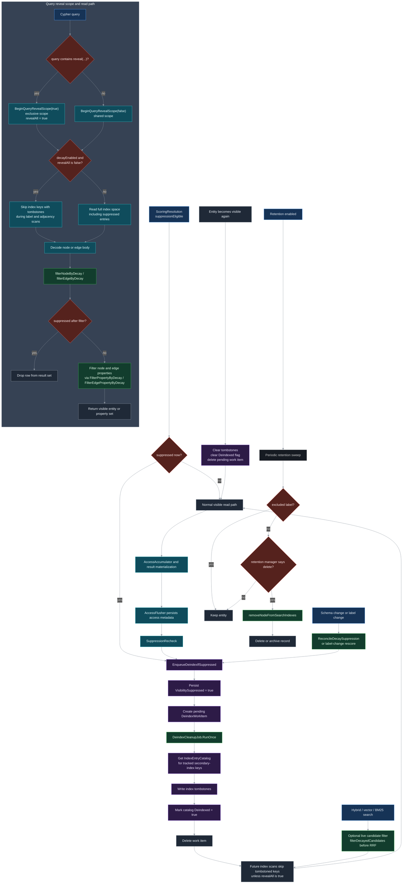

# Knowledge-Policy Visibility Layer and Deindex

**What happens after the scorer marks an entity suppressible: query-time reveal gating, persisted suppression state, deindex cleanup, search/index hiding, and eventual retention-driven deletion.**

This document covers the **downstream path after `SuppressionEligible` is computed**. It starts where the scoring pipeline hands off to the visibility layer and follows the implementation through `pkg/storage/`, `pkg/cypher/`, `pkg/search/`, and `pkg/nornicdb/`.

Read this after [Knowledge-Policy Scoring Pipeline](knowledge-policy-scoring-pipeline.md), which explains how the score itself is computed.

---

## Full Pipeline

---

## Legend — Source References

| Diagram box                              | Source                                                                           |
| ---------------------------------------- | -------------------------------------------------------------------------------- |
| `hasRevealCall` / `setRevealOnEngine`    | `pkg/cypher/reveal.go`                                                           |
| `BeginQueryRevealScope` / `SetRevealAll` | `pkg/storage/badger_decay_filter.go`                                             |
| Tombstone-aware read scans               | `pkg/storage/badger_queries.go`                                                  |
| Final entity read filter                 | `pkg/storage/badger_decay_filter.go`                                             |
| Property-level visibility filtering      | `pkg/cypher/node_helpers.go`, `pkg/storage/badger_decay_filter.go`               |
| `EnqueueDeindexIfSuppressed`             | `pkg/storage/badger_deindex_enqueue.go`                                          |
| `DeindexCleanupJob`                      | `pkg/storage/badger_deindex_cleanup.go`                                          |
| `IndexEntryCatalog` / tombstones         | `pkg/storage/badger_index_catalog.go`, `pkg/storage/badger_index_tombstone.go`   |
| Reconcile and label-change re-score      | `pkg/storage/badger_decay_reconcile.go`, `pkg/storage/badger_deindex_enqueue.go` |
| Access flusher recheck callback          | `pkg/knowledgepolicy/access_flusher.go`, `pkg/nornicdb/db.go`                    |
| Search candidate decay filter hook       | `pkg/search/decay_filter.go`, `pkg/search/search.go`                             |
| Retention sweep and search-index removal | `pkg/nornicdb/db_retention.go`, `pkg/nornicdb/search_services.go`                |

---

## Stages

### 1. Reveal scope is a query-level gate, not a scoring override

Cypher detects `reveal(...)` in the submitted query text and calls `setRevealOnEngine`, which in turn uses `BeginQueryRevealScope` on the underlying `BadgerEngine`.

- Reveal queries take an **exclusive** scope and set `revealAll = true` for that query.
- Normal queries take a **shared** scope so they cannot observe another query's reveal mode.
- This bypass lives at the storage/read layer. It does not rewrite scores or persisted suppression state.

### 2. Visibility is enforced twice on reads

The visibility layer does not rely on a single check.

- **Index-time hiding:** Badger label and adjacency scans skip index keys that have suppression tombstones when decay is enabled and `revealAll` is false.
- **Entity-time hiding:** after decoding a node or edge body, `filterNodeByDecay` / `filterEdgeByDecay` re-evaluates whether the entity should be dropped.

That second check matters because it keeps correctness even if a body is reached through a path that did not come from a tombstoned secondary index key.

### 3. Property suppression is applied after entity visibility

If an entity survives the node/edge visibility filter, the Cypher materialization path still removes properties whose property-level rules are currently suppressed.

- Nodes are filtered in `nodeToMap`.
- Edges are filtered in `edgeToMap`.
- The property scorer uses the same namespace and access metadata inputs as the entity scorer, but evaluates per-property compiled overrides.

### 4. Persisted suppression state is the fallback truth when no scorer exists

`filterNodeByDecay` and `filterEdgeByDecay` first try to obtain a namespace scorer. If no scorer exists, the engine falls back to the persisted `VisibilitySuppressed` flag on the node or edge body.

That makes the persisted flag important even though live scoring usually decides visibility.

### 5. Becoming suppressed enqueues deindex work, not immediate index deletion

When `EnqueueDeindexIfSuppressed` determines that an entity newly crossed into the suppressed state, it:

1. rewrites the body with `VisibilitySuppressed = true`
2. creates a pending `DeindexWorkItem`
3. leaves primary storage intact

The actual secondary-index cleanup is deferred to `DeindexCleanupJob`.

### 6. Deindex cleanup writes tombstones over tracked index keys

`DeindexCleanupJob` processes pending work items by consulting the entity's `IndexEntryCatalog`, which stores the exact secondary-index keys written for that entity.

The cleanup job then:

1. writes tombstones for those keys
2. marks the catalog `Deindexed = true`
3. deletes the work item

This is why later scans can cheaply hide suppressed entities before they are even decoded.

### 7. Re-visibility clears tombstones and deindex bookkeeping

If a later re-score says the entity is visible again, `EnqueueDeindexIfSuppressed` takes the opposite branch.

- It clears stored tombstones for the entity's tracked index keys.
- It clears the catalog's `Deindexed` flag.
- It removes any pending `DeindexWorkItem`.

That restoration path is what lets a previously suppressed entity re-enter normal query/index visibility without rebuilding the entire database.

### 8. Suppression can be triggered from multiple reconciliation paths

The access flusher is only one trigger.

- `SuppressionRecheck` from the access flusher re-runs `EnqueueDeindexIfSuppressed` after persisted access metadata changes.
- Schema-policy changes use `ReconcileDecaySuppression` / `ReconcileDecaySuppressionWithChanges` to revisit every entity in a namespace.
- Label changes use `rescoreSuppressionAfterLabelChangeInTxn` so the stored flag follows the node's new binding.

### 9. Search has two hiding mechanisms

There are two distinct search-layer mechanisms in the repo.

- The durable mechanism is the deindex/tombstone path above, which removes suppressed entities from the secondary indexes that search builds from.
- The search service also exposes an optional live `nodeDecayFilter` hook and applies it through `filterDecayedCandidates` before RRF fusion.

The second path is a runtime candidate filter; the first path is the persistent storage/index cleanup path.

### 10. Retention is downstream and independent of suppression

Retention is **not** the same subsystem as decay suppression.

- Suppression hides entities from normal reads and search.
- Retention, when enabled, runs a periodic sweep over stored nodes.
- The sweep skips configured excluded labels.
- If the retention manager decides a record should be deleted or archived, the DB removes it from search indexes and then processes the record.

So “suppressed for a long time and later deleted” is not a direct hand-off from the scorer. It is an operational sequence where a separate retention subsystem eventually processes the still-stored record.

---

## Relation To The Scoring Page

The scoring page ends when `SuppressionEligible` is determined. This page starts there and explains:

- how reveal mode changes what queries can see
- how suppressed entities are hidden from normal reads
- how deindex work is enqueued and later materialized as tombstones
- how entities become visible again
- how retention can eventually delete still-suppressed records

## See Also

- [Knowledge-Policy Scoring Pipeline](knowledge-policy-scoring-pipeline.md) — score computation before the visibility hand-off
- [Visibility Suppression and Deindex](../user-guides/visibility-suppression-deindex.md) — user-facing semantics and operational usage
- [Retention Policies](../user-guides/retention-policies.md) — operator-facing retention configuration and caveats
- [Knowledge Policy Metrics](../observability/knowledge-policy-metrics.md) — counters and histograms emitted by the scoring and visibility paths
