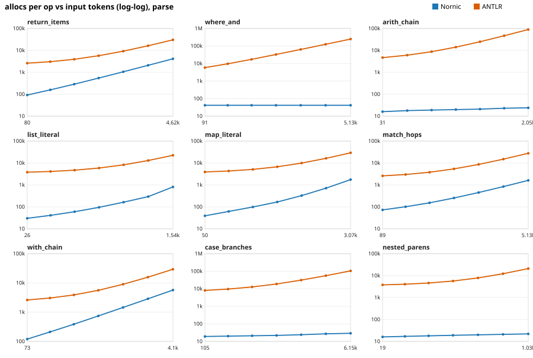
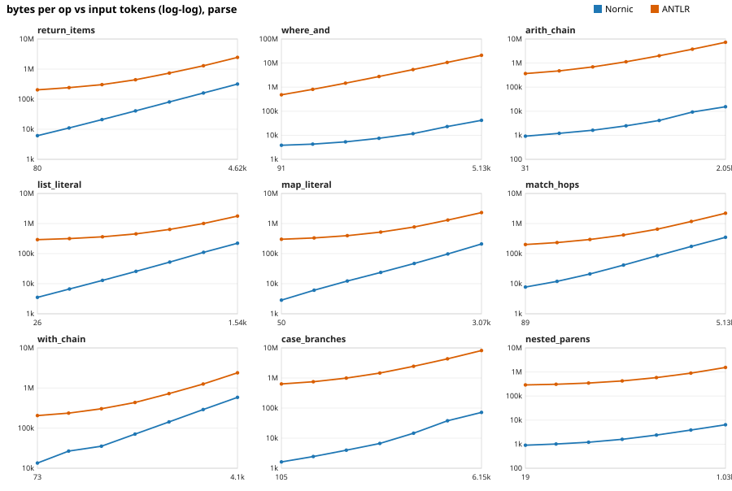
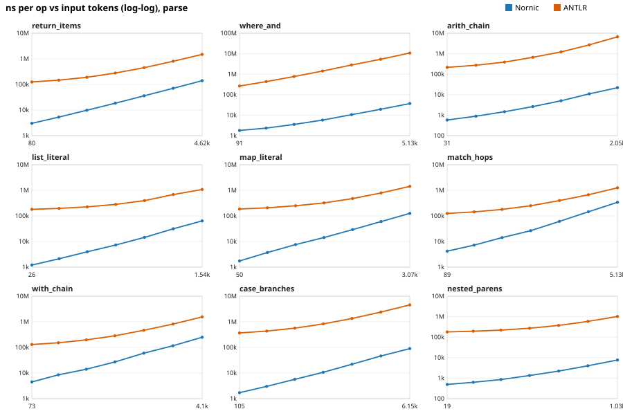
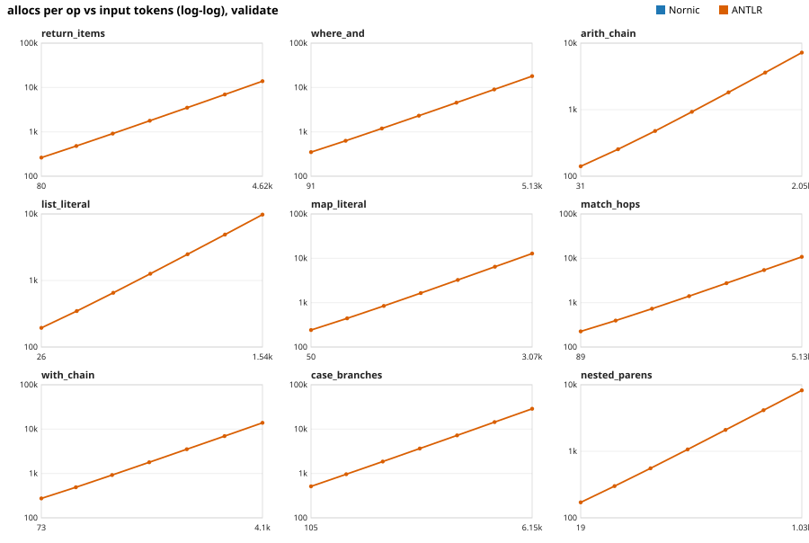
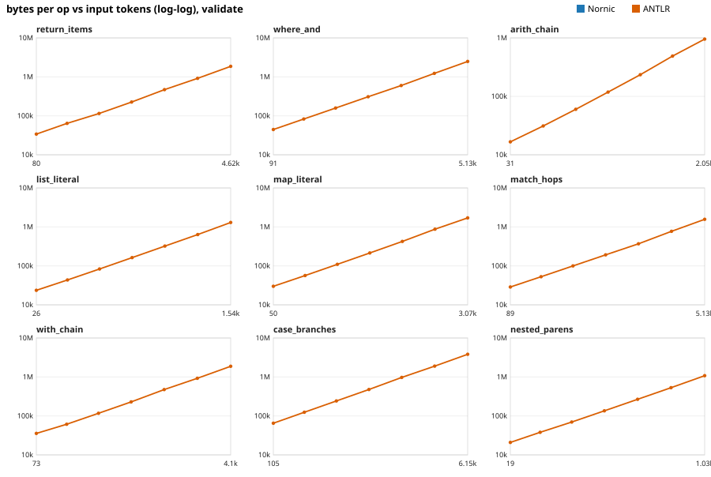
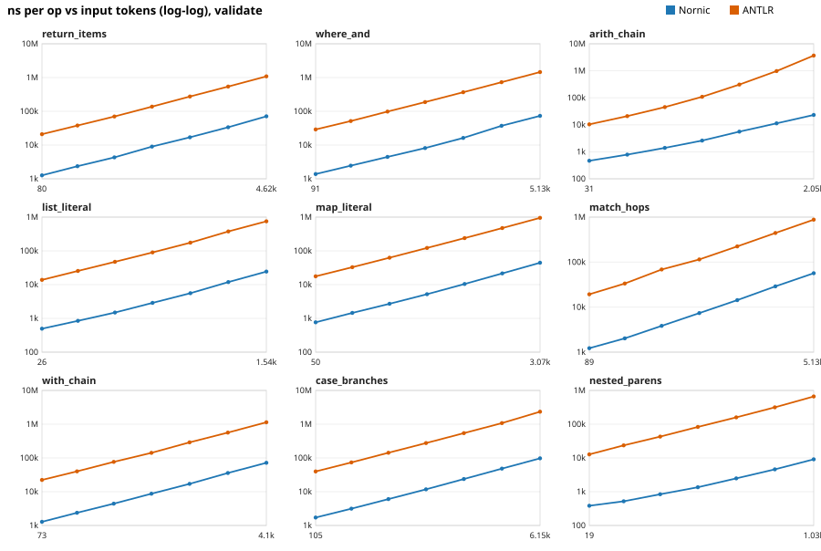

# Parser asymptotic study: Nornic vs ANTLR

Machine: darwin/arm64, 14 CPUs, go1.27.1. Sizes n = [8, 16, 32, 64, 128, 256, 512].

Each family grows one query dimension n. Cost is fit as `y = c * tokens^k` on a log-log scale; `k` is the growth exponent (1 = linear, 2 = quadratic) and R² is fit quality. Fits use the largest 4 sizes, where per-call constant overhead no longer flattens the slope. **allocs/op and B/op do not depend on the hardware; ns/op does.** Tokens come from the ANTLR lexer, used as a common input-size measure for both parsers.

## Growth exponents, mode = parse

| family | parser | allocs k | bytes k | time k | allocs growth |
|---|---|---|---|---|---|
| return_items | nornic | 0.98 (R²=1.000) | 0.99 (R²=1.000) | 0.98 (R²=1.000) | ~O(n) |
| return_items | antlr | 0.81 (R²=0.997) | 0.83 (R²=0.998) | 0.81 (R²=0.997) | ~O(n) |
| where_and | nornic | 0.00 (R²=1.000) | 0.85 (R²=0.994) | 0.90 (R²=1.000) | O(1) |
| where_and | antlr | 0.98 (R²=1.000) | 0.99 (R²=1.000) | 0.98 (R²=1.000) | ~O(n) |
| arith_chain | nornic | 0.09 (R²=0.980) | 0.91 (R²=0.991) | 1.03 (R²=0.999) | O(1) |
| arith_chain | antlr | 0.89 (R²=0.999) | 0.90 (R²=0.999) | 1.11 (R²=0.992) | ~O(n) |
| list_literal | nornic | 1.02 (R²=0.975) | 1.04 (R²=1.000) | 1.05 (R²=0.999) | ~O(n) |
| list_literal | antlr | 0.65 (R²=0.989) | 0.66 (R²=0.988) | 0.66 (R²=0.992) | ~O(n) |
| map_literal | nornic | 1.13 (R²=0.996) | 1.05 (R²=0.999) | 1.05 (R²=1.000) | ~O(n) |
| map_literal | antlr | 0.71 (R²=0.993) | 0.72 (R²=0.993) | 0.72 (R²=0.993) | ~O(n) |
| match_hops | nornic | 0.90 (R²=0.999) | 1.03 (R²=1.000) | 1.24 (R²=1.000) | ~O(n) |
| match_hops | antlr | 0.79 (R²=0.996) | 0.81 (R²=0.995) | 0.78 (R²=0.996) | ~O(n) |
| with_chain | nornic | 0.99 (R²=1.000) | 1.02 (R²=1.000) | 1.07 (R²=0.999) | ~O(n) |
| with_chain | antlr | 0.80 (R²=0.997) | 0.82 (R²=0.997) | 0.82 (R²=0.997) | ~O(n) |
| case_branches | nornic | 0.14 (R²=0.992) | 1.17 (R²=0.995) | 1.03 (R²=0.999) | O(1) |
| case_branches | antlr | 0.83 (R²=0.998) | 0.83 (R²=0.998) | 0.83 (R²=0.996) | ~O(n) |
| nested_parens | nornic | 0.07 (R²=0.999) | 0.68 (R²=0.998) | 0.85 (R²=0.997) | O(1) |
| nested_parens | antlr | 0.63 (R²=0.989) | 0.63 (R²=0.986) | 0.64 (R²=0.986) | ~O(n) |

## Growth exponents, mode = validate

| family | parser | allocs k | bytes k | time k | allocs growth |
|---|---|---|---|---|---|
| return_items | nornic | 0 allocs (constant) | 0 allocs (constant) | 1.00 (R²=0.999) | O(1) |
| return_items | antlr | 0.99 (R²=1.000) | 1.02 (R²=1.000) | 1.00 (R²=1.000) | ~O(n) |
| where_and | nornic | 0 allocs (constant) | 0 allocs (constant) | 1.08 (R²=0.999) | O(1) |
| where_and | antlr | 0.99 (R²=1.000) | 1.01 (R²=1.000) | 0.99 (R²=1.000) | ~O(n) |
| arith_chain | nornic | 0 allocs (constant) | 0 allocs (constant) | 1.05 (R²=1.000) | O(1) |
| arith_chain | antlr | 0.98 (R²=1.000) | 1.01 (R²=1.000) | 1.68 (R²=0.997) | ~O(n) |
| list_literal | nornic | 0 allocs (constant) | 0 allocs (constant) | 1.04 (R²=0.999) | O(1) |
| list_literal | antlr | 0.99 (R²=1.000) | 1.00 (R²=1.000) | 1.03 (R²=0.999) | ~O(n) |
| map_literal | nornic | 0 allocs (constant) | 0 allocs (constant) | 1.04 (R²=1.000) | O(1) |
| map_literal | antlr | 0.99 (R²=1.000) | 1.00 (R²=1.000) | 0.99 (R²=1.000) | ~O(n) |
| match_hops | nornic | 0 allocs (constant) | 0 allocs (constant) | 0.99 (R²=1.000) | O(1) |
| match_hops | antlr | 0.99 (R²=1.000) | 1.02 (R²=0.999) | 0.99 (R²=1.000) | ~O(n) |
| with_chain | nornic | 0 allocs (constant) | 0 allocs (constant) | 1.02 (R²=1.000) | O(1) |
| with_chain | antlr | 0.99 (R²=1.000) | 1.02 (R²=1.000) | 1.01 (R²=1.000) | ~O(n) |
| case_branches | nornic | 0 allocs (constant) | 0 allocs (constant) | 1.02 (R²=1.000) | O(1) |
| case_branches | antlr | 1.00 (R²=1.000) | 1.00 (R²=1.000) | 1.03 (R²=0.999) | ~O(n) |
| nested_parens | nornic | 0 allocs (constant) | 0 allocs (constant) | 0.92 (R²=0.999) | O(1) |
| nested_parens | antlr | 0.99 (R²=1.000) | 1.01 (R²=1.000) | 1.01 (R²=0.999) | ~O(n) |

## Cost at the largest size (parse mode)

| family | tokens | Nornic allocs | ANTLR allocs | ratio | Nornic B | ANTLR B | Nornic time | ANTLR time | ratio |
|---|---|---|---|---|---|---|---|---|---|
| return_items | 4616 | 4,136 | 30,345 | 7x | 319kB | 2.44MB | 139.5µs | 1489.4µs | 11x |
| where_and | 5131 | 42 | 248,303 | 5912x | 41.7kB | 21.2MB | 37.0µs | 10839.0µs | 293x |
| arith_chain | 2047 | 24 | 89,379 | 3724x | 15.4kB | 7.3MB | 22.0µs | 6662.6µs | 303x |
| list_literal | 1538 | 810 | 22,476 | 28x | 222kB | 1.78MB | 64.0µs | 1076.0µs | 17x |
| map_literal | 3074 | 1,746 | 29,130 | 17x | 210kB | 2.32MB | 125.6µs | 1422.8µs | 11x |
| match_hops | 5129 | 1,616 | 27,803 | 17x | 350kB | 2.21MB | 341.4µs | 1250.8µs | 4x |
| with_chain | 4105 | 5,683 | 29,339 | 5x | 585kB | 2.39MB | 249.9µs | 1551.5µs | 6x |
| case_branches | 6153 | 29 | 104,854 | 3616x | 72kB | 8.22MB | 90.1µs | 4560.1µs | 51x |
| nested_parens | 1027 | 22 | 20,928 | 951x | 6.42kB | 1.55MB | 7.7µs | 1023.4µs | 133x |

## Tail latency and GC (parse mode, n=32, fixed input)

| input | parser | p50 µs | p95 µs | p99 µs | max µs | max/p50 | GCs | GC pause ms |
|---|---|---|---|---|---|---|---|---|
| return_items/n=32 | nornic | 8.0 | 18.9 | 42.8 | 160 | 20x | 60 | 1.93 |
| return_items/n=32 | antlr | 180.9 | 402.5 | 566.5 | 3018 | 17x | 929 | 37.82 |
| where_and/n=32 | nornic | 3.1 | 5.0 | 10.1 | 183 | 59x | 15 | 0.50 |
| where_and/n=32 | antlr | 718.1 | 1231.3 | 1442.0 | 9614 | 13x | 4353 | 190.12 |
| arith_chain/n=32 | nornic | 1.5 | 2.1 | 5.5 | 77 | 53x | 4 | 0.20 |
| arith_chain/n=32 | antlr | 357.7 | 727.8 | 840.0 | 4025 | 11x | 2117 | 73.96 |
| list_literal/n=32 | nornic | 2.9 | 8.4 | 20.8 | 101 | 35x | 36 | 1.17 |
| list_literal/n=32 | antlr | 205.3 | 438.9 | 577.2 | 2350 | 11x | 1114 | 40.66 |
| map_literal/n=32 | nornic | 6.6 | 13.5 | 27.4 | 130 | 20x | 37 | 1.21 |
| map_literal/n=32 | antlr | 228.8 | 486.1 | 665.7 | 1103 | 5x | 1212 | 45.03 |
| match_hops/n=32 | nornic | 12.0 | 21.2 | 48.1 | 178 | 15x | 62 | 2.00 |
| match_hops/n=32 | antlr | 164.0 | 362.2 | 466.4 | 1517 | 9x | 908 | 31.16 |
| with_chain/n=32 | nornic | 11.5 | 28.9 | 67.3 | 182 | 16x | 101 | 3.33 |
| with_chain/n=32 | antlr | 180.2 | 384.2 | 523.6 | 947 | 5x | 923 | 30.64 |
| case_branches/n=32 | nornic | 5.6 | 7.0 | 11.7 | 209 | 38x | 12 | 0.37 |
| case_branches/n=32 | antlr | 510.8 | 941.0 | 1020.2 | 5663 | 11x | 3033 | 102.30 |
| nested_parens/n=32 | nornic | 0.8 | 1.1 | 2.3 | 40 | 54x | 3 | 0.09 |
| nested_parens/n=32 | antlr | 199.2 | 424.4 | 561.2 | 1961 | 10x | 1067 | 37.50 |

## How to read this, and its limits

- **What this proves.** The exponent `k` and the allocation counts are properties of the algorithm and its memory behaviour, not of this CPU. A parser whose allocs/op grow as tokens^1 and whose constant is 30x lower is cheaper on any hardware. ns/op is reported but is the weakest evidence.
- **What this does not prove.** Fits are empirical over n = 8..max, not a proof of asymptotic class. Confirm with a derivation from the algorithm (e.g. each token consumed once, no backtracking) before claiming O(n) in print.
- **The parsers do different amounts of work.** `nornic parse` (`ASTBuilder.Build`) is a clause splitter plus string-based clause parsing, and `nornic validate` is a set of scanners. ANTLR runs a full grammar (ALL(*)) and, in parse mode, builds a complete parse tree. A big ratio partly reflects "less work", not only "better implementation". The fair statement is the cost of getting a usable structure out of the query, plus the exponents. Check `Clauses` and error rejection parity before claiming equivalence.
- **Caches.** The Nornic validate path memoises per-executor; the harness clears it before each call. ANTLR's DFA cache stays warm (as in a long-running server), which favours ANTLR.
- **Scope.** This is parse time only. End-to-end query latency (storage, planning, execution) is dominated by other costs, so parser results should not be presented as database speedups.
