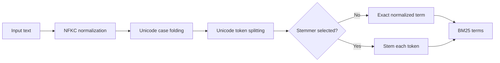
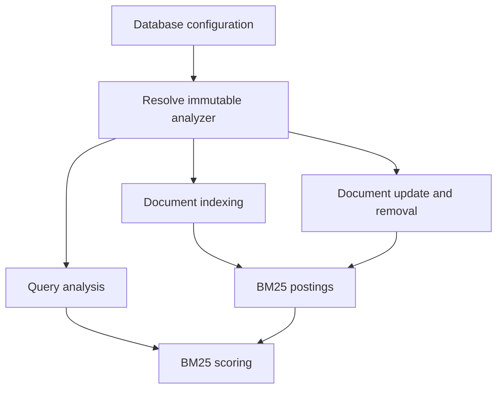
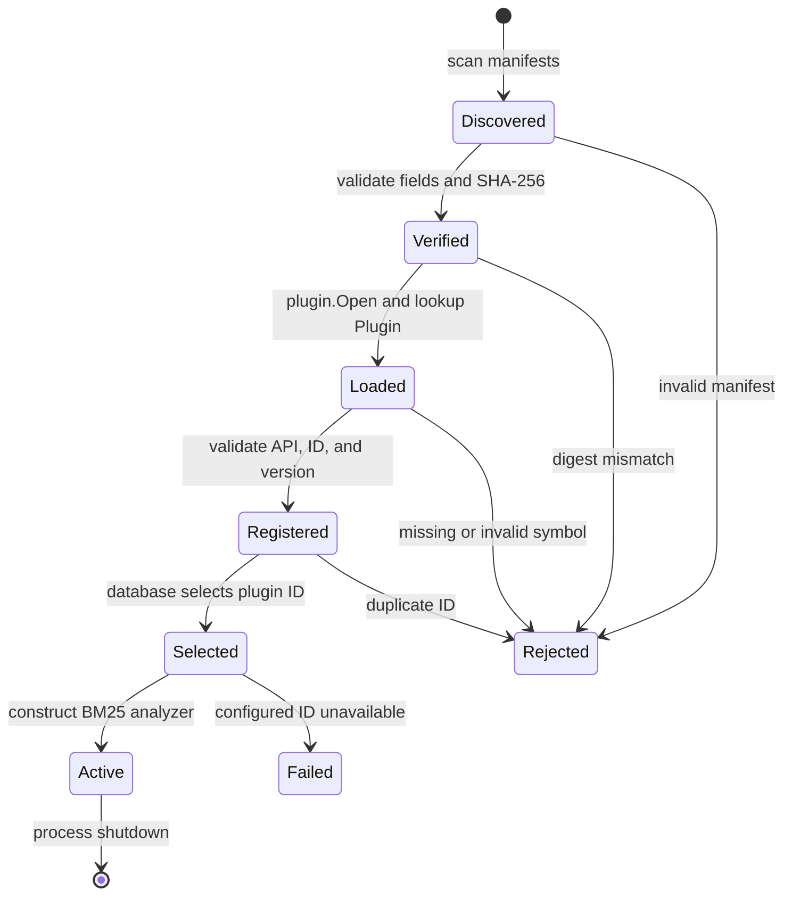
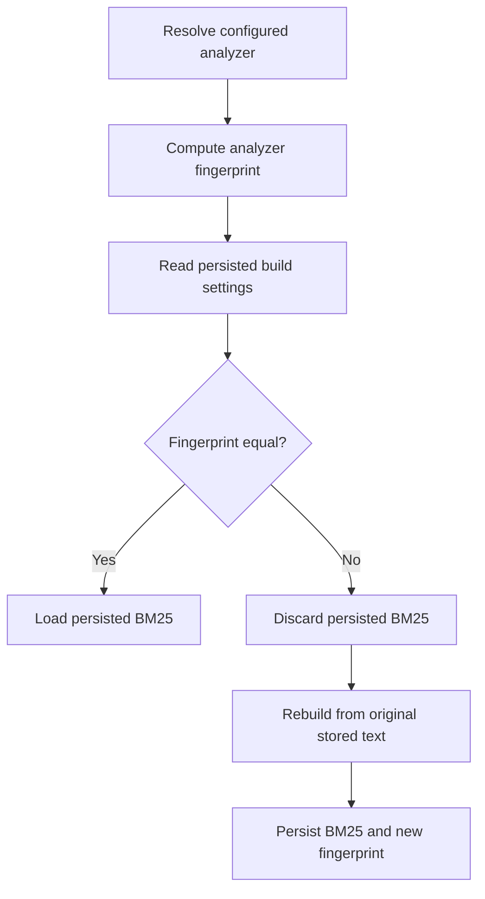

# RFC: Pluggable BM25 Stemmers and Snowball Packaging

**Status:** Proposed  
**Issue:** [#347](https://github.com/orneryd/NornicDB/issues/347)  
**Target:** Post-v1.3.2  
**Authors:** NornicDB maintainers

## Summary

Add an optional, language-invariant stemmer extension point to NornicDB's BM25 analyzer. NornicDB continues to own Unicode normalization, case folding, tokenization, index/query consistency, configuration, and persisted-index compatibility. A selected plugin performs one operation:

```text
normalized token -> stemmed token
```

The default remains the current exact Unicode analyzer with no stemming. NornicDB will not add a production language stemmer or a Snowball dependency. Instead, it will expose a small Go plugin API and provide a separate `nornicdb-snowball` tool that packages generated Snowball Go code behind that API without requiring plugin authors to write a wrapper. The general-purpose `nornicdb-admin` tool remains independent of Snowball.

Ukrainian text is the default integration-test scenario. The test plugin exists only to verify lifecycle and retrieval behavior; it is not presented as a complete Ukrainian linguistic algorithm.

## Motivation

The current analyzer in [`pkg/search/fulltext_index.go`](https://github.com/orneryd/nornicdb/blob/main/pkg/search/fulltext_index.go) performs NFKC normalization, Unicode case folding, and Unicode-aware token splitting. This intentionally language-neutral behavior is the correct default, but inflected forms remain distinct BM25 terms.

For example, an application may want a query containing `України` to retrieve a document containing `Україною`. That requires language-specific stemming. The language rules should not become part of NornicDB core.

Snowball is relevant because its compiler generates Go functions with this shape:

```go
func Stem(env *snowballRuntime.Env) bool
```

The function mutates `env`, and the caller reads the result from `env.Current()`. Directly using that function as NornicDB's runtime plugin ABI would couple the server to Snowball's Go runtime package and exact module version. Go plugin type identity would also require the host and plugin to share that dependency exactly.

This RFC therefore separates two contracts:

1. A dependency-free NornicDB runtime ABI: `Stem(string) string`.
2. A build-time Snowball adapter generated by the standalone `nornicdb-snowball` tool.

Plugin authors can consume generated Snowball output without writing wrappers, while NornicDB core and `nornicdb-admin` add no Snowball or language dependency.

## Goals

- Preserve the existing language-neutral analyzer as the default.
- Add no Snowball runtime or language package to NornicDB's `go.mod`.
- Allow independently built stemmer plugins to extend BM25 analysis.
- Use the same immutable analyzer for indexing, updating, removal, and querying.
- Make Snowball-generated Go code consumable without a hand-written adapter.
- Keep Snowball packaging in a standalone `nornicdb-snowball` binary rather than `nornicdb-admin`.
- Select stemmers per database by stable ID, not by filesystem path.
- Rebuild persisted BM25 indexes whenever stemmer identity or code changes.
- Provide Ukrainian integration scenarios for inflected forms and Unicode behavior.
- Measure indexing throughput, query latency, bytes, and allocations with plugins inactive and active.
- Run lifecycle, correctness, persistence, concurrency, and plugin-loading tests in CI.

## Non-Goals

- Shipping a production Ukrainian, Russian, English, or other language stemmer.
- Automatic language detection.
- Selecting different stemmers per token or document.
- Stopword removal, lemmatization, translation, transliteration, synonyms, or spelling correction.
- Loading plugins over the network.
- Hot loading, unloading, or replacing plugins without restarting NornicDB.
- Sandboxing trusted in-process Go plugins.
- Changing phrase-search semantics.
- Adding Snowball commands or dependencies to `nornicdb-admin`.
- Adding CGo, `libstemmer`, WASM, or a subprocess protocol.

## Terminology

- **Tokenizer:** NornicDB's existing NFKC, case-folding, Unicode token splitter.
- **Stemmer:** A plugin that maps one normalized token to zero or one term.
- **Analyzer:** The tokenizer plus an optional stemmer.
- **Plugin ID:** Stable operator-facing identifier such as `snowball.ukrainian`.
- **Analyzer fingerprint:** Tokenizer ID plus plugin ID, plugin version, and plugin digest.
- **Snowball adapter:** Generated bridge from `Stem(*snowball.Env) bool` to NornicDB's runtime ABI.
- **Snowball packaging tool:** The standalone `nornicdb-snowball` command that produces `.so` and manifest files for local installation.

## Current State

Both BM25 implementations call the package-level `tokenize` function for document indexing, update removal, and querying:

- [`pkg/search/fulltext_index.go`](https://github.com/orneryd/nornicdb/blob/main/pkg/search/fulltext_index.go)
- [`pkg/search/fulltext_index_v2.go`](https://github.com/orneryd/nornicdb/blob/main/pkg/search/fulltext_index_v2.go)

Persisted build compatibility already records an analyzer value through [`pkg/search/build_settings.go`](https://github.com/orneryd/nornicdb/blob/main/pkg/search/build_settings.go). Today that value is the constant `unicode-nfkc-casefold-v1`.

NornicDB already loads trusted Go `.so` plugins at startup through [`pkg/nornicdb/plugins.go`](https://github.com/orneryd/nornicdb/blob/main/pkg/nornicdb/plugins.go). The stemmer loader should follow the same platform and trust model while using a dedicated directory and registry.

## Proposed Analysis Pipeline



The same analyzer instance processes indexed documents and queries:



Phrase search remains literal against original stored text and does not invoke the stemmer.

## Core API

Add a small package at `pkg/search/stemmer` containing only NornicDB-owned types:

```go
package stemmer

const APIVersion = 1

type Plugin interface {
    Stem(token string) string
}
```

Contract:

- `Stem()` receives one non-empty, valid UTF-8 token after NFKC normalization and Unicode case folding.
- `Stem()` returns one non-empty, valid UTF-8 token.
- Returning the input preserves it.
- `Stem()` must be deterministic and safe for concurrent calls.
- `Stem()` must not perform filesystem, network, database, configuration, or logging operations.
- Implementations must not retain the input string after returning.

Manifest files, not plugin methods, provide the plugin ID, version, type, and ABI version. The narrow API deliberately excludes initialization, start, stop, shutdown, metadata, and configuration hooks. A stemmer is pure token processing and has no service lifecycle of its own.

The loader keeps a process-wide immutable registry:

```go
type Registration struct {
    APIVersion int
    ID         string
    Version    string
    Digest     string
    Path       string
    Stem       func(string) string
}

func Lookup(id string) (Registration, bool)
func Available() []Registration
```

The registry is populated once during startup and frozen before any search service is constructed. All metadata comes from verified manifests; the plugin symbol only supplies `Stem`.

## Plugin Artifact

Each stemmer is distributed as two local files:

```text
plugins/stemmers/
  snowball-ukrainian.so
  snowball-ukrainian.stemmer.json
```

Manifest schema:

```json
{
  "schema_version": 1,
  "api_version": 1,
  "type": "bm25_stemmer",
  "id": "snowball.ukrainian",
  "version": "1.0.0",
  "language": "ukrainian",
  "library": "snowball-ukrainian.so",
  "sha256": "<lowercase hex digest>",
  "entrypoint": "Plugin"
}
```

Fields:

| Field            | Required | Meaning                                                                  |
| ---------------- | -------: | ------------------------------------------------------------------------ |
| `schema_version` |      Yes | NornicDB manifest contract; initially `1`.                               |
| `api_version`    |      Yes | NornicDB stemmer ABI; must equal `stemmer.APIVersion`.                   |
| `type`           |      Yes | Must be `bm25_stemmer`.                                                  |
| `id`             |      Yes | Stable configuration key; lowercase letters, digits, dots, `_`, and `-`. |
| `version`        |      Yes | Plugin-defined semantic version or immutable release identifier.         |
| `language`        |       No | Human-readable Snowball language label for inventory and docs.           |
| `library`        |      Yes | Basename of the adjacent `.so`; directory traversal is rejected.         |
| `sha256`         |      Yes | Digest of the exact `.so` loaded by NornicDB.                            |
| `entrypoint`     |      Yes | Exported symbol; initially only `Plugin` is accepted.                    |

The loaded symbol must implement `stemmer.Plugin`. The manifest is the source of truth for type, ID, version, API version, library name, and digest.

## Configuration

Global plugin discovery:

```yaml
plugins:
  stemmers:
    directory: ./plugins/stemmers
```

Environment equivalents:

```text
NORNICDB_STEMMER_PLUGINS_DIR=./plugins/stemmers
```

Per-database selection:

```text
db.nornic.search.bm25.stemmer=snowball.ukrainian
```

Global default selection:

```text
NORNICDB_SEARCH_BM25_STEMMER=none
```

Rules:

- `none` is the default and preserves current behavior.
- An unset or empty stemmer plugin directory disables plugin discovery.
- A non-empty stemmer plugin directory enables startup discovery; no separate enable flag exists.
- Database configuration stores only a plugin ID, never a path.
- Per-database configuration overrides the global default.
- The stemmer plugin directory is a process-level setting.
- Selection is resolved before the database's search service is constructed.
- Changing the directory or plugin files requires restart.
- Changing a database's selection among already-registered plugin IDs invokes a complete search-service rebuild through the existing hot-reload path.
- A configured but unavailable plugin is an error for that database's BM25 initialization.
- NornicDB must never silently fall back to `none` when a stemmer was configured.
- Vector search remains available if BM25 initialization is disabled or reported failed through the existing index-state mechanism.

The setting registry should expose `db.nornic.search.bm25.stemmer` as a dynamic string setting with `RestartNone` and `HotReloadSearchRebuild`. A valid update atomically replaces the database's search service and rebuilds BM25 from original stored text. If the selected ID is unavailable or rebuilding fails, the setting update fails and the prior search service remains active.

## Plugin Lifecycle



Detailed startup order:

1. Read process plugin settings.
2. Scan `*.stemmer.json` files in lexical filename order.
3. Validate each manifest without executing plugin code.
4. Resolve and validate the adjacent library path.
5. Compute and compare SHA-256 before `plugin.Open`.
6. Open the `.so` and look up `Plugin`.
7. Validate that the symbol implements the NornicDB stemmer API and that the manifest ID is unique.
8. Freeze the registry.
9. Resolve each database's selected plugin ID.
10. Construct one immutable analyzer per search service.
11. Compare its fingerprint with persisted build settings.
12. Load the BM25 index on a match or rebuild it on a mismatch.

Go plugins cannot be unloaded. Adding, replacing, or removing a stemmer therefore requires process restart. This matches NornicDB's existing plugin lifecycle and avoids partial analyzer transitions.

## Snowball Compatibility Without a Core Dependency

Snowball-generated Go uses a mutable runtime environment:

```go
func Stem(env *snowballRuntime.Env) bool
```

NornicDB's runtime plugin ABI intentionally does not use this type. Matching it directly would require NornicDB core to import the same Snowball runtime module and version as every plugin.

Instead, add a standalone packaging command:

```text
nornicdb-snowball package \
  --language ukrainian \
  --id snowball.ukrainian \
  --version 1.0.0 \
  --module ./stemmer-module \
  --source ./generated/stemmer.go \
  --output ./plugins/stemmers/snowball-ukrainian.so
```

Expected author workflow:

```text
snowball algorithm.sbl -go -P main -o stemmer-module/stemmer.go
cd stemmer-module && go mod vendor && cd ..
nornicdb-snowball package \
  --language ukrainian \
  --id snowball.ukrainian \
  --version 1.0.0 \
  --module ./stemmer-module \
  --source ./stemmer-module/stemmer.go \
  --output ./plugins/stemmers/snowball-ukrainian.so
```

The `nornicdb-snowball package` command:

1. Verifies that the supplied local module has a `go.mod`, `go.sum`, and vendored dependencies.
2. Copies the module into an isolated temporary directory.
3. Verifies that the generated source uses package `main` and detects its imported Snowball runtime path.
4. Generates a bridge in the same `main` package.
5. Reuses `snowballRuntime.Env` instances through `sync.Pool`.
6. Exposes a `Plugin` symbol implementing NornicDB's stemmer API.
7. Runs `GOPROXY=off go build -mod=vendor -buildmode=plugin`.
8. Computes SHA-256.
9. Writes the adjacent `.stemmer.json` manifest.
10. Deletes the temporary build directory.

The command is intentionally separate from `nornicdb-admin`. It does not open or mutate a database and does not need access to any NornicDB data directory. The selected database only stores the resulting plugin ID, for example:

```text
db.nornic.search.bm25.stemmer=snowball.ukrainian
```

That keeps the runtime contract small: NornicDB selects a registered stemmer by ID per database, and the standalone tool owns Snowball-specific packaging mechanics.

Conceptual generated bridge:

```go
var envPool = sync.Pool{
    New: func() any { return snowballRuntime.NewEnv("") },
}

type generatedStemmer struct{}

func (generatedStemmer) Stem(token string) string {
    env := envPool.Get().(*snowballRuntime.Env)
    env.SetCurrent(token)
    Stem(env)
    result := env.Current()
    env.SetCurrent("")
    envPool.Put(env)
    return result
}

var Plugin generatedStemmer
```

Plugin authors do not write this bridge. Their generated Snowball source and its runtime dependency remain inside the plugin's build boundary. NornicDB core and `nornicdb-admin` add no Snowball module.

The packaging command is convenience tooling, not a package manager. It does not download `.sbl` files or Go modules, infer language choice, or choose dependency versions. The author supplies all source and a vendored module. Snowball runtime code remains a plugin-owned build dependency and never enters NornicDB's root `go.mod`, `nornicdb-admin`, or server binary.

## BM25 Integration

Replace the package-global tokenizer dependency with an immutable analyzer owned by each BM25 index:

```go
type textAnalyzer struct {
    id   string
    stem func(string) string
}

func (a textAnalyzer) Analyze(text string) []string
```

`Analyze` performs the existing NFKC normalization, case folding, and Unicode splitting, then invokes the optional stemmer once per token.

Required call sites:

- BM25 V1 single-document index.
- BM25 V1 batch index.
- BM25 V1 update/removal token reconstruction.
- BM25 V1 query analysis.
- BM25 V2 single and batch index.
- BM25 V2 update/removal token reconstruction.
- BM25 V2 query analysis.
- Hybrid-routing lexical profile tokenization, using the service's analyzer.

Constructors should preserve source compatibility:

```go
func NewFulltextIndex() *FulltextIndex
func NewFulltextIndexV2() *FulltextIndexV2
func NewFulltextIndexWithAnalyzer(analyzer Analyzer) *FulltextIndex
func NewFulltextIndexV2WithAnalyzer(analyzer Analyzer) *FulltextIndexV2
```

The existing constructors use the exact Unicode analyzer.

The V2 analyzer is immutable. Its query-plan cache therefore does not need the analyzer ID in every key. Replacing an analyzer requires replacing or clearing the index and query cache as part of the rebuild.

## Persistence and Rebuild Semantics

The BM25 build-settings fingerprint becomes:

```text
schema=3;
format=<bm25-format>;
tokenizer=unicode-nfkc-casefold-v1;
stemmer=<id-or-none>;
stemmer_api=<api-version-or-none>;
stemmer_version=<version-or-none>;
stemmer_sha256=<digest-or-none>;
props=<ordered-property-list>
```

Any change to tokenizer ID, stemmer ID, stemmer API version, stemmer version, plugin digest, BM25 format, or property projection forces a BM25 rebuild from storage.



The SHA-256 participates even when ID and version are unchanged. This prevents silently loading postings produced by different code under reused metadata.

Original document text remains stored unchanged for display, reranking, phrase search, and future analyzer rebuilds.

## Error Handling

Startup validation errors include:

- malformed manifest;
- unsupported manifest schema;
- unsupported stemmer API version;
- invalid plugin ID or version;
- missing library;
- path traversal or non-regular library file;
- digest mismatch;
- unsupported platform;
- `plugin.Open` failure;
- missing `Plugin` symbol;
- wrong plugin symbol shape;
- duplicate plugin ID;
- configured plugin ID not registered.

A selected stemmer failure must be visible in search build status and logs. NornicDB must not query a persisted index using a different analyzer.

Because the plugin is trusted in-process code, `Stem` has no recoverable error return. Panics remain plugin defects. The generated Snowball bridge is deterministic and contains no user callbacks.

## Platform Support

Version 1 follows the existing Go plugin support matrix:

- Linux amd64/arm64: supported.
- macOS amd64/arm64: supported.
- Windows: dynamic `.so` loading is unavailable.

On Windows, `none` remains supported. Statically registered stemmers may be considered separately, but this RFC does not add a second loading mechanism.

A plugin must be built with a compatible Go toolchain and NornicDB stemmer API version. Packaging tooling records these values in build output and rejects obvious mismatches before installation where possible.

## Security Model

Stemmer plugins use the same trust boundary as existing NornicDB Go plugins: they execute in-process with server permissions and must come from a trusted source.

Version 1 adds these controls without introducing a new runtime:

- no network plugin loading;
- explicit process-level plugin directory;
- manifest path confinement;
- required SHA-256 verification before execution;
- stable ID selection instead of arbitrary database-configured paths;
- duplicate-ID rejection;
- immutable startup registry;
- digest in persisted analyzer compatibility;
- plugin inventory in startup logs without exposing document tokens.

This RFC does not claim that hashing makes untrusted native code safe. Operators remain responsible for approving plugin source and artifacts.

## Ukrainian Test Scenario

The repository will include a test-only plugin named `test.ukrainian`. It is a deterministic fixture for extension behavior, not a production Ukrainian stemmer and not a Snowball language implementation.

Minimum retrieval scenarios:

| Indexed form              | Query form  | Expected                                            |
| ------------------------- | ----------- | --------------------------------------------------- |
| `Україна`                 | `України`   | Match with fixture plugin.                          |
| `Україною`                | `Україна`   | Match with fixture plugin.                          |
| `пошук`                   | `пошуку`    | Match with fixture plugin.                          |
| `пошуком`                 | `пошук`     | Match with fixture plugin.                          |
| `КИЇВ`                    | `київ`      | Match before stemming through Unicode case folding. |
| unrelated Ukrainian token | query token | No false match in fixture cases.                    |

The same cases must not be forced to match under `none`; this proves opt-in behavior.

Additional scenarios:

- composed and decomposed Unicode input normalizes identically;
- indexing and querying call the same stemmer;
- updates remove postings generated by the previous document text;
- document removal leaves no stemmed postings;
- every fixture input produces one non-empty term;
- persisted index reload succeeds with the same digest;
- changed plugin digest forces rebuild;
- configured missing plugin fails BM25 initialization;
- concurrent queries are race-free;
- original document text and phrase search remain unchanged.

## Test Plan and CI

### Unit Tests

Add tests for:

- analyzer normalization and stem order;
- `none` behavior parity with the current tokenizer;
- plugin registry validation and duplicate rejection;
- manifest parsing, path confinement, and digest verification;
- analyzer fingerprint composition;
- V1 and V2 index/query/update/remove parity;
- V2 query-plan cache isolation;
- service construction from per-database configuration;
- persisted-index rebuild decisions.

### Dynamic Plugin Integration Tests

On Linux and macOS CI:

1. Build the test-only Ukrainian fixture with `go build -buildmode=plugin`.
2. Generate its manifest and digest.
3. Start the loader against a temporary plugin directory.
4. Select `test.ukrainian` for a test database.
5. Run the Ukrainian retrieval scenarios through BM25 V1 and V2.
6. Restart against persisted indexes and verify equivalent results.
7. Modify the fixture digest and prove the index rebuild path is selected.

On Windows CI, run analyzer and registry tests with an in-process fixture and explicitly skip only dynamic-loading coverage.

### Snowball Packaging Tool Tests

The standalone `cmd/nornicdb-snowball` package receives golden tests using a small generated-style fixture with the official `Stem(*Env) bool` shape. Tests verify generated bridge source, manifest fields, digest calculation, and actionable compiler errors.

No Snowball module or language algorithm is added to the repository's root `go.mod`. End-to-end packaging against an external Snowball runtime may run in a separate tooling job with a pinned fixture module, not in core package tests.

### Documentation Usage Tests

Documentation examples that show `nornicdb-snowball` usage must be covered by tests. At minimum:

- every documented `nornicdb-snowball package` example parses with the command's real flag set;
- every example includes a language, plugin ID, version, source module, generated source path, and output plugin path;
- manifest examples parse as JSON and include every required field;
- per-database selection examples use plugin IDs, never filesystem paths;
- documentation must not document an admin-CLI Snowball packaging command or any Snowball dependency in `nornicdb-admin`.

These documentation tests run in ordinary package tests so command examples drift only when tests are updated with the implementation.

### Race and Fuzz Tests

CI commands:

```sh
go test ./pkg/search ./pkg/nornicdb ./pkg/config/... -count=1
go test -race ./pkg/search ./pkg/nornicdb -run 'Stemmer|Analyzer|BM25' -count=1
go test ./pkg/search -run 'Ukrainian|Stemmer|Analyzer' -count=1
go test ./pkg/nornicdb -run 'StemmerPlugin' -count=1
```

Fuzz targets cover manifest parsing, plugin IDs, Unicode analyzer input, empty/large tokens, and invalid UTF-8 boundaries.

The new tests must be wired into the existing `make test` path and the platform matrix, not left as manual-only tests.

## Performance and Profiling Plan

Measure three configurations:

1. `none`, no stemmer plugins installed.
2. `none`, plugins discovered and loaded but not selected.
3. `test.ukrainian`, plugin selected and active.

Configuration 2 must have no per-token or per-query overhead compared with configuration 1. Plugin discovery is startup-only.

Add benchmarks for:

- analyzer throughput over Latin and Ukrainian text;
- BM25 V2 batch indexing;
- BM25 V2 exact warm common query;
- BM25 V2 exact cold common query;
- BM25 V2 rare query;
- update/removal token reconstruction;
- concurrent query execution with the selected plugin.

Run at least ten repetitions with allocations:

```sh
go test ./pkg/search -run '^$' \
  -bench 'Benchmark(TextAnalyzer|BM25V2.*Stemmer)' \
  -benchmem -benchtime=250ms -count=10 > stemmer-bench.txt

benchstat baseline-bench.txt stemmer-bench.txt
```

Capture CPU and heap profiles for active stemming:

```sh
go test ./pkg/search -run '^$' \
  -bench 'BenchmarkBM25V2.*Stemmer' \
  -benchmem -benchtime=5s \
  -cpuprofile stemmer-cpu.out \
  -memprofile stemmer-mem.out

go tool pprof -top stemmer-cpu.out
go tool pprof -top -alloc_space stemmer-mem.out
```

Acceptance gates:

- Configuration 2 shows no statistically significant query or allocation regression from plugin loading alone.
- Default `none` retains current BM25 correctness and benchmark results.
- Active-plugin performance is reported separately rather than compared as if stemming were free.
- The generated Snowball bridge reuses mutable runtime environments and does not allocate one environment per token.
- No unbounded term expansion is introduced; one input token produces at most one output term.
- Any active-plugin regression larger than 10% in BM25 query latency or indexing throughput requires profiling evidence and explicit approval.
- CI runs a short benchmark smoke test to catch catastrophic regressions; release validation records the ten-run `benchstat` comparison.

## Observability

Expose selected analyzer information through search build status and startup logs:

```text
BM25 analyzer: tokenizer=unicode-nfkc-casefold-v1 stemmer=snowball.ukrainian version=1.0.0 digest=abc123...
```

Do not log source tokens or stems.

Extend `db.index.fulltext.listAvailableAnalyzers()` to report actual registered analyzers rather than names unsupported by the active BM25 implementation. Each row should include:

- analyzer ID;
- kind (`exact` or `stemmer`);
- plugin version;
- digest prefix;
- dynamic-load support on the current platform;
- selected databases, if authorized for that metadata.

## Documentation Deliverables

- Operator guide for installing, hashing, selecting, and upgrading a stemmer plugin.
- Plugin-author guide for the NornicDB API.
- Snowball-generated-code packaging guide with copy-paste commands.
- Platform compatibility statement.
- Persisted-index rebuild behavior.
- Troubleshooting for ABI mismatch, digest mismatch, missing IDs, and rebuild failures.
- Explicit statement that NornicDB ships no language stemmer by default.

## Rollout Plan

### Phase 1: Analyzer Abstraction

- Introduce immutable analyzer types.
- Preserve existing constructors and exact Unicode behavior.
- Route V1, V2, updates, removals, queries, and hybrid lexical profiles through the analyzer.
- Add parity tests and baseline benchmarks.

### Phase 2: Plugin API and Loader

- Add the stemmer API package and immutable registry.
- Add manifest parsing and SHA-256 verification.
- Add process configuration and per-database selection.
- Add startup lifecycle and failure reporting.
- Add Ukrainian fixture-plugin integration tests.

### Phase 3: Persistence and Introspection

- Add stemmer metadata to BM25 build settings.
- Force rebuild on ID, version, or digest changes.
- Update analyzer-listing procedures to reflect reality.
- Add restart and persisted-index regression tests.

### Phase 4: Snowball Packaging Tool

- Add standalone `cmd/nornicdb-snowball` with `nornicdb-snowball package`.
- Generate the bridge and manifest automatically.
- Add golden tests for the generated ABI adapter.
- Add documentation usage tests for every published command example.
- Document plugin-owned dependency and toolchain requirements.

### Phase 5: Performance Validation

- Add inactive and active plugin benchmarks.
- Run CPU and allocation profiles.
- Optimize only measured hotspots, including environment pooling.
- Record benchmark hardware, Go version, dataset, and `benchstat` output.
- Enable all correctness and race tests in CI.

## Acceptance Criteria

- Existing installations retain exact Unicode BM25 behavior without configuration changes.
- NornicDB core adds no external stemming or language dependency.
- A trusted `.so` stemmer can be installed and selected per database.
- Generated Snowball Go can be packaged without a hand-written wrapper.
- Indexing, querying, updating, and removal use the same analyzer.
- Persisted BM25 cannot load under a mismatched plugin fingerprint.
- Ukrainian fixture scenarios pass under both BM25 engines.
- Default analyzer parity, race, restart, and dynamic plugin tests run in CI.
- BM25 benchmarks report latency, throughput, bytes, and allocations for inactive and active plugin configurations.
- Phrase search and original stored text remain unchanged.

## Open Questions

1. Should a future release support statically linked stemmer registration on Windows, or keep external stemmers limited to platforms supported by Go plugins?
2. Should `nornicdb-snowball package` accept only a local module with a committed `go.sum`, or also accept a single generated source file plus an explicitly pinned runtime module?
3. Should plugin manifests include an optional human-readable language tag for UI display, while keeping selection based solely on opaque plugin ID?

These questions do not block the analyzer abstraction, plugin ABI, lifecycle, persistence fingerprint, Ukrainian CI fixture, or performance work described above.
