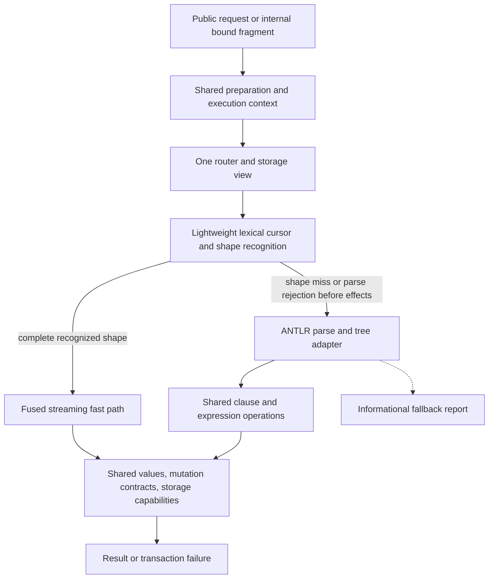

# Cypher convergence and compatibility refactor

## Goal

Finish the supported Cypher surface with one set of semantics across query
positions, execution paths, storage wrappers, and transaction modes. Preserve
NornicDB's stream-parse-execute architecture: recognize common shapes cheaply,
execute them with fused streaming operations, carry bindings and cancellation
through recursive parsing, and use ANTLR for uncovered syntax. Expand fast-path
coverage using measured fallback reports after correctness is established.

The first implementation step is the official **openCypher Technology
Compatibility Kit (TCK)** in CI. OpenSpec records the behavior contracts and
work sequence; the TCK and a pinned Neo4j reference validate them independently.

An apparent standards conflict gets a named compatibility decision and a test;
it does not justify preserving a silent wrong answer. Nornic-specific extensions
have their own contract and are not scored as openCypher failures.

## Evidence and current baseline

Baseline revision: `a427a46815c607d0801331f4975e26cc941d125a` on
`cypher-parser-refactor`. Issue inventory date: 2026-09-21.

Technical sources:

- [Divergence report](../divergence_report/DIVERGENCE_REPORT.md) and
  [machine-readable evidence](../divergence_report/data.json).
- [Hard convergence](../divergence_report/HARD_CONVERGENCE.md).
- Concepts for [routing](../divergence_report/CONCEPT_single_router.md),
  [execution](../divergence_report/CONCEPT_2_execution_entry_points.md), and
  [expressions](../divergence_report/CONCEPT_3_expression_evaluation.md).
- [Architecture discussion #23](https://github.com/orneryd/NornicDB/discussions/23)
  and [conformance proposal #482](https://github.com/orneryd/NornicDB/issues/482).

The original report uses `994b3a68`; the newer concepts use `a427a468`.
The latter matches this branch. Report line numbers and clone counts are
historical evidence, not an inventory of work still to do.

| Finding | Consequence for implementation |
| --- | --- |
| #483–#486 cleanup and #488 single-router work already landed | Preserve them; do not schedule another router merge. `executeQueryAgainstStorage` now delegates to `executeWithoutTransaction`. |
| Public `Execute` and internal `executeInternal` duplicate preparation | Extract shared preparation while preserving intentional public/internal lifecycle differences. |
| Shape handlers, `executePipeline`, pattern executors, and fast paths overlap | Converge semantics and prove each optimization's complete shape coverage. |
| The concept's pipeline-first experiment reports 18 semantic failures and 14 route assertions | Neither legacy route is an oracle. Reproduce these findings; retain performance-path assertions. |
| Four expression-text fallthrough sites span six evaluator families | Collapse real semantic duplication; the existing thin `evaluateExpression…` wrappers are not themselves six separate interpreters. |
| `validateSyntaxANTLR` only calls `antlr.Validate` | Build an ANTLR-tree execution adapter. Enabling `NORNICDB_PARSER=antlr` alone does not provide independent execution. |
| Async pure-CREATE can bypass transactional writes | Verify atomicity, visibility, and rollback before preserving that optimization. #461's cause remains a hypothesis until reproduced. |
| Current CI coverage job has `continue-on-error: true` | Give conformance its own required job with an actual failing exit status. |

The live GitHub snapshot contains **45 open issues: 35 in this effort and 10
outside it**. The 35 comprise 33 correctness/storage bugs, one performance issue
(#487), and one proposal (#482). See the exhaustive
[issue matrix](cypher-convergence-issues.md). Refresh it at each milestone;
closing existing issues cannot substitute for fixing newly discovered TCK gaps.

Reproduce the reports' experiments and performance measurements in Step 1.
The referenced raw `results5/` experiments and `graphify/analyze.py` are not
included in the report directory. Recover the generator and inputs, or record
a reproducible local replacement; retain its commands and provenance with the
regenerated candidate ledger.

## Architecture decisions

| Topic | Decision |
| --- | --- |
| Production entry | One shared preparation contract and one router; explicit transaction mode selects a storage view and lifecycle, not another dispatch table. |
| Default front end | Lightweight shared lexical cursor and recursive shape recognition; keep the context/partial representation as parsing proceeds. No obligatory full ANTLR tree on a proven hot path. |
| General fallback | ANTLR parses uncovered shapes; an adapter lowers its tree to shared expression/clause contracts. Retire independently interpreted text pipelines and monolithic semantic copies as coverage transfers. |
| Semantic reuse | Shared scope, typed expression behavior, grouping, projection, ordering, mutation, and storage contracts. Fast paths can fuse these operations without per-row generic dispatch. |
| Internal calls | Pass bindings/parameters and parsed fragments; do not substitute resolved values into Cypher source. Cancellation, authorization, database, and transaction ownership remain attached. |
| Errors | Unsupported expressions and unconsumed syntax never become successful string values or silently discarded clauses. Runtime errors terminate execution and roll back writes. |
| Snapshot isolation | Preserve a stable explicit-transaction snapshot plus own writes. Equal results across modes are required on equivalent quiescent state, not across deliberately different snapshots. |
| Autocommit | One statement is atomic; internal write transactions are allowed. Persistent explicit transactions start only on client `BEGIN` (text or protocol), never as a side effect of subquery re-entry. |
| ALTER | Preserve working ALTER DATABASE / ALTER COMPOSITE DATABASE behavior in transactions. Verify rollback semantics rather than treating routing success as proof. Decay/promotion policy changes stay separate. |
| Performance | Keep fast-path hit assertions, streaming, projection pushdown, pooled scratch where ownership is safe, and bit-mask classification where measured useful. Target zero transient allocation in eligible kernels. |
| Fallback reporting | Correct fallback execution passes CI. Produce an informational workload report to prioritize new fast paths; no quota of fast-path coverage is a correctness gate. |

The default retains shape-specific stream-parse-execute. The fallback and fast
paths share semantic building blocks, validated through TCK and differential
tests. ANTLR supplies parsing; an execution adapter must connect its tree to
those shared semantics. The existing pipeline is not a correctness oracle.



### Fallback and effect boundary

Implement a typed outcome instead of overloading `nil`, `false`, or an arbitrary
error: `Handled(result)`, `NotApplicable(reason)`, `ParseRejected(location)`,
or `Failed(error)`. A fast path must prove it consumes the entire statement or
entire explicitly bounded fragment, including tails and nested clauses.

`NotApplicable` and `ParseRejected` permit ANTLR only while the attempt has
produced **no observable effects**. Those effects include writes, procedure or
external I/O, emitted result rows, and transaction-control changes. Parse/shape
recognition may happen incrementally, but validate write-bearing boundaries
before mutations or stage them in the statement's atomic write context.

If a legacy attempt discovers a parse problem after effects, roll it back and
return an error until it has been migrated to the safe contract. Do not restart
the query in the same dirty transaction or replay it after rows were emitted.
This transitional restriction disappears by moving the eligibility decision
before effects, not by introducing retries that duplicate writes. Runtime,
constraint, storage, cancellation, or authorization errors never trigger parser
fallback. ANTLR syntax rejection is final; a valid but unimplemented construct
returns an explicit unsupported-feature error until implemented.

Writes in an explicit transaction that encounter a terminal error invalidate
the transaction and cannot subsequently COMMIT partial work; protocol recovery
must leave the connection usable according to the Bolt contract. Autocommit
failure leaves no persistent statement effects. COMMIT/ROLLBACK do not start a
replacement transaction. Nested CALL/FOREACH execution never owns the parent's
commit. An error after streaming rows invalidates the stream; no replay occurs.

### Proposed implementation boundaries

Names below describe new internal modules, not existing APIs:

| Module | Contract and migration sources |
| --- | --- |
| `execution_context.go`, `execution_prepare.go` | Request context, database/auth, params, storage view, transaction ownership, source span, binding scope, scratch lifetime; extract from `executor.go` / `executor_internal.go`. |
| `lexical_cursor.go`, `shape_dispatch.go` | Quotes, escapes, backticks, comments, nesting, token spans and complete-shape eligibility; converge splitters without reparsing bound values. |
| `eval_scope.go`, `eval_value.go`, expression modules | One lookup with `(value, found)`; distinguish undefined names from a bound null. Keep numeric/temporal/list/map/entity identity and typed errors. Adapt families E, B, C/D to A's shared core; compiled F remains an optimization. |
| `antlr_adapter.go` plus clause-specific adapters | Lower actual ANTLR rule contexts, including nested expressions; do not extract text and call the old string dispatcher. Audit current `ASTBuilder` types before reuse. |
| `clause_projection.go`, `clause_aggregate.go`, `clause_order.go`, mutation/subquery modules | Shared semantics with streaming or blocking behavior dictated by the clause; reusable inside fused executors and ANTLR fallback. |
| Storage capability contracts | Explicit read options, snapshot/projection/embedding selection, streaming and batch mutation interfaces; named wrappers retain namespacing, overlays, WAL and hooks. |

Keep new files below 2,500 lines. Split touched oversized handwritten files by
these boundaries as their responsibilities migrate. Generated ANTLR output is
regenerated from grammar and is never manually rearranged to satisfy a line
counter. Record generated files separately from the handwritten size report.

## Step 1 — Install the correctness baseline before parser changes

### 1A. Pin and run the official corpus

Use [openCypher TCK](https://github.com/opencypher/openCypher/tree/370fe27f417730dca2ef712dd1c0c5dadcb99ef8/tck)
at `370fe27f417730dca2ef712dd1c0c5dadcb99ef8` as the initial candidate pin:
its tree contains 220 `.feature` files. Expanded
scenario counts must be computed by the runner, not inferred from file counts.
Record the archive checksum, license/notice, tool versions, and graph fixtures.
Changes to the upstream pin are separate reviewed baseline updates.

Build the adapter in Go using a pinned Gherkin/Godog runner and the repository's
existing official Neo4j Go driver. The required upstream asset is the official
feature corpus; this plan does not assume a ready-made official Go SDK. Keep
the test runner in `testing/cypher/tck/`, fixtures and provenance in
`testing/cypher/tck/testdata/`, and entry scripts in `scripts/cypher-tck/`.
Keep the corpus unchanged; local GitHub reproductions belong beside it.

Launch the actual server with `noui,nolocalllm`, isolated Badger data, and
embeddings disabled for deterministic semantic tests. Connect over Bolt. Run
each scenario on a fresh graph in both:

1. Driver autocommit, consuming all results so completion errors are observed.
2. Explicit driver transaction, consuming results, checking in-transaction state,
   then COMMIT and checking from a fresh session. Error cases verify rollback.

Commit graph setup before the statement under test in both modes. Never execute
the two variants sequentially against the same already-mutated fixture.
Add managed-transaction driver smoke cases and text `BEGIN/COMMIT/ROLLBACK`
tests separately; driver retries must not hide a failed execution attempt.

Implement all step forms, backgrounds, scenario outlines/examples, named graphs,
parameters, typed expected values, ordered/unordered result assertions, side
effects, and error type/phase/detail. Inventory the pinned steps before coding.
Unknown or unbound steps are harness failures, never skipped passes.

The [TCK contract](https://github.com/opencypher/openCypher/blob/370fe27f417730dca2ef712dd1c0c5dadcb99ef8/tck/README.adoc)
defines result, error and observable graph checks. Follow its side-effect
definitions rather than trusting mutation counters: property replacement and
label counts need particular care. Validate fixture loading and the comparator
against hand-checked examples and a pinned Neo4j server before trusting a
NornicDB baseline. Adapter or comparator defects are harness errors. If valid
fixture/observer queries expose a database defect, record that defect separately
and mark dependent scenarios blocked by it; do not score their unexecuted query
as passing or failing. Include blocked counts in the denominator and remove
every such block before final qualification. Include a create-then-delete control
and a property replacement control in the harness self-tests.

Comparator rules: retain column names/order, integer versus float distinctions,
nulls, list order, duplicate rows, map contents, graph topology and path direction.
Compare unordered rows as multisets. Canonicalize engine-specific entity IDs
while preserving identity relationships; never collapse distinct equal-property
nodes. Honor the TCK's explicit ordering/value rules, including any unordered
list expectation; do not sort every list. Differential cases with tied sort
keys compare valid tie groups or add a deterministic tie-breaker. Do not use an
undocumented numeric tolerance to hide type errors.

### 1B. Ratchet, reproduction ledger, and independent reference

Check in a baseline keyed by `(upstream SHA, feature path, scenario name,
example row, transaction mode, route mode)`, with status, failure signature,
issue/local gap ID, reason, and responsible workstream. Route mode initially
means normal execution; add forced ANTLR fallback when Step 4 exists. The
existing `NORNICDB_PARSER=antlr` setting is only a syntax-mode axis today.

Run the entire pinned suite on every relevant PR, sharded if necessary. CI fails
on newly failing previously passing scenarios, changed failure signatures,
missing scenarios, undefined steps, crashes/timeouts, unclassified failures,
or stale expected-failure entries that now pass. Newly blocked cases also fail
the regression gate. Remove an expected failure in
the same PR as its fix. Do not replace the baseline automatically after a red
run, use wildcard exclusions, or hide unsupported scenarios from the denominator.
Report supported-pass, expected-gap, setup-blocked, harness-error and total
counts separately.
This initially permits documented existing gaps; the final target is zero
failures on the pinned core TCK, with every proposed scope exception explicit.

Import all reproductions and variants from the 35 scoped issues, including
#452's comment. Use `gh-<number>-<case>` IDs. The 131-case battery is referenced
but not supplied as runnable files: reconstruct from issues or obtain it, and
report the recovered count instead of claiming all 131 are already available.
Each issue maps to exact TCK IDs after discovery; the matrix lists families
only because exact scenario matches have not yet been established. If no
upstream case covers a bug, its local regression remains a first-class gate.

Run a pinned Neo4j 5.x image by exact patch and digest for issue reproductions
and shared-language differential cases. Choose and record that digest in 1A;
do not use floating `neo4j:5`. TCK is authoritative for its pinned language;
Neo4j is supplementary evidence for the stated Neo4j compatibility target.
Keep newer Neo4j functions/DDL and Nornic extensions in separate suites. Resolve
version conflicts explicitly instead of declaring one server universally right.

### 1C. CI and baseline performance

Add `cypher-conformance.yml` with PR, push, and manual triggers covering `pkg`,
`testing/cypher`, runner scripts, OpenSpec, plan files, workflow changes and Go
dependencies. The job must not use `continue-on-error`. Publish JUnit, JSON,
family counts, mode differences and minimized repro artifacts even on failure.
Branch-protection required-check configuration is a separate repository setting
to apply during rollout; a workflow file alone does not enforce merging policy.

Add a fixed Neo4j differential corpus to PR checks; put bounded grammar-based
generation, shrinking and longer concurrency/fault runs in nightly jobs. New
counterexamples become permanent local regressions and ledger entries.

Record current package test failures separately, without excusing new failures.
Baseline `BenchmarkStatementRouting`, existing Northwind fast-path and UNWIND
benchmarks, expression kernels, and production-stack reads/writes. Record exact
revision, hardware, Go version, build tags, data, indexes, cache policy and mode.

Step 1 is complete only when the runner actually executes the corpus in both
modes, its own negative controls fail correctly, all 35 issues are classified,
the baseline and required job exist, and repeated runs show stable results.
A workflow scaffold or an all-skipped test run does not satisfy this gate.

## Delivery sequence

Each row is a bounded change/PR family. Split a row further when needed, without
mixing unrelated semantic changes. Follow the dependency column and exit gates.

| Step / change ID | Work and primary files | Depends on | Exit evidence |
| --- | --- | --- | --- |
| 1 `add-cypher-tck-baseline` | Runner, corpus provenance, issue regressions, CI, current benchmarks as above | Plan review | Real two-mode baseline and harness self-tests; all known gaps classified |
| 2 `unify-cypher-context` | Shared preparation/scope; instrument four unresolved-expression sites; lexical scanner; fallback outcomes and effect boundary | 1 | Existing tests/route assertions preserved; auth, USE, cancellation, quoting and nested-scope tests; measured allocations |
| 3A `repair-cypher-mutations` | Fold scope-free SET into shared evaluator, evaluate nested map values, preserve entity binding, null-removal and MERGE branches; consume REMOVE/SET tails | 2 | #462, #474, #455, #456, #470, #480 repros fail before and pass after; cross-session readback and rollback |
| 3B `unify-cypher-storage-views` | Production-stack contract tests; async CREATE publication/MVCC; embedding overlay visibility; canonical values; wrapper capability forwarding | 1, context contract from 2 | #461/#448 repaired, #475 storage leg covered; SI, rollback, reopen and concurrent update tests |
| 4 `connect-antlr-fallback` | Audit grammar/AST coverage; ANTLR rule adapter and shared clause contracts; first vertical slices RETURN, MATCH/WHERE, UNWIND/WITH and mutations | 2, 3A for writes | Forced fallback executes those slices independently of legacy text dispatch; fast/fallback/TCK parity; misses counted |
| 5 `converge-cypher-expressions` | Fold computed-row and WHERE families into common semantics; recursive postfix access, lists/maps, temporal/numeric rules, strict errors | 3A, 3B, 4 slices | #453/#454/#458/#460/#465–#468/#471/#475–#477 and expression portion of #478 fixed in every relevant position |
| 6 `converge-cypher-composition` | Grouping, aggregate expression trees, projection scope, complete sort keys, OPTIONAL MATCH, bound CALL/FOREACH/UNION, write/read barriers | 4–5 | #447/#449–#452/#457/#459/#463/#464/#468/#469/#478/#479/#481 pass; add remaining TCK clause coverage |
| 7 `stream-snapshot-reads` | Snapshot-visible projected iterators, pending-write overlay, early stop, statement scratch; preserve optimized route selection | 3B, 6 relevant semantics | #487 before/after profile and benchmarks, bounded LIMIT scan proof, unchanged SI; no unsupported capability fallback |
| 8 `retire-cypher-divergence` | Non-policy DDL parser convergence, relevant node/edge kernels, remaining TCK gaps, remove obsolete handlers/evaluators and text re-entry | 3–7 | Complete TCK/issue matrix, deletion ledger, no hidden semantic fallback, extension suite green |
| 9 `verify-cypher-release` | Full regression/race/coverage/build/bench evidence, compatibility docs, release notes, rollout and fallback report | 8 | Completion evidence reviewed; issues closure-ready; no unresolved core gap |

Step 3A/3B prioritize stored corruption and missing data. Implement their local
reproductions first; do not postpone them until the full ANTLR adapter exists.
All migrated paths must error on failed evaluation immediately. Temporary
observability of legacy fallthrough is for migration measurement, not a release
mode that knowingly stores expression text. Do not add a permissive production
flag that turns errors back into values.

### Detailed semantic work packages

**Expressions (Steps 2, 3A, 5).** Create the shared scope once per row/frame,
with explicit parent/import boundaries and parameter lookup. Preserve fast
leaf evaluation without reconstructing node/relationship maps for each call.
Recursive postfix evaluation must handle `p[0]`, slices, `m.b.c`, `f(x).p`,
map projections and temporal components everywhere an expression is legal.
Missing variables are errors; missing properties and bound optional nulls follow
Cypher null rules. WHERE keeps only true, drops false/null, and rejects invalid
predicate types; generic Go truthiness is not the contract. Test CASE/COALESCE
short-circuiting, numeric precedence/coercion, string extrema, list predicates,
parameter lists in all storage representations and typed temporal persistence.

**Projection, aggregation and ordering (Steps 5–6).** Extract aggregate nodes
from expression trees, group by the correct nonaggregate expressions, evaluate
aggregate arguments per input row, then evaluate enclosing expressions over
aggregate results. Test empty-input global aggregates and grouped empties,
DISTINCT, nulls and optional null rows. Projection reads the input scope before
publishing aliases: `RETURN c.name AS c` must not overwrite its own input.
Resolve ORDER BY against the legal pre/post-projection scope, including hidden
keys and multiple directions; preserve WITH ordering into collect. DISTINCT
and aggregation restrict which hidden variables are available. LIMIT cannot
stop a scan before required grouping or sorting, and writes cannot be skipped
merely because their returned rows are limited.

**Composition (Step 6).** Preserve cardinality and optional null-extension,
including a WHERE attached to OPTIONAL MATCH. UNWIND binds each row before
MATCH evaluates property expressions. Correlated CALL imports explicit bindings,
keeps outer scope, and merges yielded outputs with defined collision behavior.
FOREACH and UNION use child frames and shared transaction ownership. Dynamic
Cypher procedures receive query text only when text is their actual API input;
all values still pass as parameters. Track every remaining `executeInternal`
text-substitution caller until converted or explicitly justified.

**Storage (Steps 3B, 7–8).** Test Memory, Badger, Namespaced→Async→WAL→Badger,
transaction wrappers and relevant multidb views. Read options distinguish live
and snapshot reads, requested properties and embeddings. Capability assertions
must express a supported promise per wrapper; a wrapper must not claim snapshot
support by delegating to a live read. Normalize value representation at a common
boundary without serializing temporals into strings. Unify individual/batch
create-update-delete contracts, preserving constraints, label/edge indexes,
callbacks, WAL, namespace isolation and MVCC publication. Batch implementations
may stay specialized behind that same contract. Publish node/edge visibility
atomically or route the unsafe async path through the atomic write context.
Recovery tests must cover existing affected databases, not only fresh writes:
if missing MVCC records require repair, provide an idempotent, scoped migration
with dry-run evidence before declaring #461 closed.

Snapshot iterators include own pending creates/updates/deletes and must not leak
newer committed versions. Preserve overlay rows during embedding flushes until
the backing version is visible. Stream candidates and copy/project only when
needed; prove early termination with visit counters rather than timing alone.
Use generics for node/edge algorithms only after matching their invariants;
different keys, constraints and index effects remain explicit typed operations.

## Report-wide convergence disposition

Every report category has a disposition. “Complete” means Cypher convergence
and the storage contracts it depends on; unrelated repository subsystems are
not silently included in a parser rewrite.

| HARD_CONVERGENCE item | Disposition |
| --- | --- |
| 1 routers | Already merged; retain reveal/decay boundary behavior and parity tests. Remaining view/cache/async concerns belong to 3B/7. |
| 2 execution entry points | Steps 2, 4, 6, 8. Share preparation and typed recursive execution; keep measured fused specializations. |
| 3 expression families | Steps 2, 3A, 5–6. One scope and semantics; adapters and compiled optimizations must not reinterpret syntax. |
| 4 read wrappers | Steps 3B/7 plus mutation API convergence. Backup capability #473 is a separate follow-up, not necessary for parser completion. |
| 5 node/edge twins | Step 8 for Cypher-facing reads/writes; pure-read generic extraction before MVCC kernels. Broader decay-related twins deferred. |
| 6 DDL parsers | Step 8 for index/constraint/database DDL using shared cursor and statement tables. Decay/promotion/knowledge-policy parser behavior deferred explicitly. |
| 7 HNSW variants | Separate search plan; preserve current search/retrieval regressions when Cypher vector-call boundaries change. |
| 8 GPU backends | Separate hardware-matrix plan; no CUDA/Metal/Vulkan driver rewrite in this effort. |
| 9 test-only reachability | Audit Cypher/storage candidates in Step 8. Wire reusable ANTLR pieces; retain public library APIs unless deprecation is approved. Reachability alone is not deletion evidence. |
| 10 smaller items | Converge property/SET splitters with 3A; constraint engine/transaction semantics with 3B; path traversal/fulltext builders only where relevant and measured. Server route/retention boilerplate deferred. Never delete the separately built `apoc/` plugin. |

At Step 1, produce a candidate ledger from the report's dispatcher, variant,
forwarding-gap, and clone records. Each entry records original symbols, whether
still present, semantic differences, action (`merge`, `retain-optimization`,
`public-api`, `already-removed`, `defer`), workstream, and proof. Similarity scores
are leads, not permission to merge algorithms with different behavior. Step 8
requires every Cypher-relevant entry to be resolved and every deferral explained.

## OpenSpec adoption

The proposed change is checked in under
[`openspec/changes/converge-cypher-execution/`](../../openspec/changes/converge-cypher-execution/proposal.md),
with proposal, design, tasks and five capability delta specs. Project context
and review rules live in [`openspec/config.yaml`](../../openspec/config.yaml).
These are proposed contracts, not a claim that they are implemented. Canonical
`openspec/specs/` is populated through verified change archival.

Use the installed OpenSpec CLI version **1.13.0**, pinning that version in the
eventual CI tool setup. The [OpenSpec workflow](https://github.com/Fission-AI/OpenSpec)
keeps proposal/spec/design/task artifacts with the code. The
[CLI reference](https://github.com/Fission-AI/OpenSpec/blob/main/docs/cli.md)
documents validation and lifecycle commands. No global installation or agent
configuration changes are needed to review these checked-in artifacts.

```bash
OPENSPEC_TELEMETRY=0 openspec validate converge-cypher-execution --strict --no-interactive
OPENSPEC_TELEMETRY=0 openspec status --change converge-cypher-execution
```

For each delivery row: create its focused change using the named ID; move the
relevant proposed requirements/tasks from this umbrella into that change or
reference the already accepted canonical capability. Avoid copying divergent
definitions into multiple active changes. Add issue IDs, exact TCK IDs, code
deletion targets, failing reproduction evidence and benchmark acceptance to
the design/tasks. Review behavior and then implement test-first. Archive a
focused change only after its evidence passes and synchronize the corresponding
spec; leave the umbrella open until all completion gates are met. Artifact
completeness reported by `openspec status` does not mean implementation complete.

Review each change against the applicable conformance, transaction and performance
contracts. Record changes to isolation, supported semantics or public APIs in
the corresponding OpenSpec delta before implementation. Preserve accepted
decisions across subsequent changes.

## Verification and performance gates

For every fix: write the issue reproduction; observe it fail on the current
baseline; implement the minimum shared fix; see it pass; add positional,
transaction-mode and edge-case variants. Do not rewrite assertions to ratify
an old wrong result. Keep the existing regression and fast-route suites.

| Dimension | Required cases |
| --- | --- |
| Execution | Normal fast-path-first; force the intended fast path where eligible; force ANTLR fallback for covered slices; syntax modes tested separately |
| Transactions | Autocommit; explicit Bolt; text BEGIN script; managed-driver smoke; own writes; commit/rollback/error/cancellation; concurrent snapshot isolation |
| Storage | Memory; persistent Badger; full production wrapper stack; relevant namespace/composite views; reopen; async flush and deterministic embedding writeback |
| Expression positions | RETURN; WITH; WHERE; SET/SET +=; CREATE/MERGE/MATCH maps; ORDER BY; aggregate argument and enclosing expression; CALL/YIELD |
| Values | Null versus undefined; int/float; empty/heterogeneous lists; maps; node/edge/path; dates/datetimes/durations; escaped strings and keyword-bearing parameters |
| Shape boundaries | Comments/backticks/quotes; nested brackets; trailing clauses; malformed tail; nested CALL/UNION/FOREACH; no-effects fallback after a miss |
| Protocol/security | Bolt plus representative HTTP/gRPC integration; USE authorization, database isolation, cache separation and transaction-local read-your-writes |

Run a practical pairwise matrix for broad coverage and the complete cross-product
for bug-specific risks. Do not call a Memory-only result production validation.
Caches cannot serve another transaction's values or stale results after own
writes; cache keys/invalidation must include the relevant database, auth,
schema and visibility dependencies, or bypass result caching in a transaction.

Required commands for implementation PRs (toolchain/native prerequisites from
the existing CI apply):

```bash
go test ./pkg/cypher/... ./pkg/storage/... ./pkg/bolt/... ./pkg/server/... ./pkg/nornicdb/...
go test -race ./pkg/cypher/... ./pkg/storage/... ./pkg/bolt/...
go test ./...
go test ./... -coverprofile=coverage.out
go tool cover -func=coverage.out
go vet ./...
golangci-lint run
go build ./cmd/nornicdb
go test ./pkg/cypher -run '^$' -bench . -benchmem -count=5
```

Add documented `make cypher-tck`, `make cypher-differential`, and
`make cypher-convergence-report` targets in Step 1; these are planned commands,
not available targets today. Apply the repository's 90% new-code minimum and
95% target for new core semantic/storage code. Report changed-code coverage and
the actual package/global baseline separately; do not claim existing packages
already meet those targets. Run the full race suite at final release qualification.

Use repeated before/after samples and benchstat on equivalent hardware and
configuration. Report latency, ops/sec, B/op, allocs/op, CPU/heap profiles and
correctness together. No unexplained >5% slowdown or >10% memory increase on a
named existing correct workload. A previously wrong/no-op query is not a valid
speed baseline; report the cost of restored semantics explicitly. Target zero
temporary allocations in leaf lookup, token classification and proven fused
loops; results, grouping and sorting may require allocations with measured
budgets. Pool buffers only within a clear lifetime; returned results must not
alias scratch returned to `sync.Pool`.

For #487, acceptance is streaming snapshot-visible label/projection scans with
no unconditional full-label materialization for eligible LIMIT queries, lower
allocations on the supplied workload, and measured per-shape improvement.
Set a numerical target after repeating the issue baseline; do not promise
identical cost for snapshot and live reads. Re-run the current
[Northwind baseline](../performance/1.1.0-northwind-results/comparison.md).
If vector/search plumbing changes, preserve the recorded
[SciFact retrieval metrics](../performance/retrieval-recall-benchmark.md#recorded-scifact-results).

## Rollout, issue closure and completion

Migrate one expression or clause family at a time behind test-only route
selection. Temporary production switches, if needed for rollout, may choose
only correctness-qualified paths; no switch restores expression-text success.
Never shadow-execute mutations on the same database. Replay write workloads
only into isolated equivalent fixtures. Retain a last qualified build as the
deployment rollback point; data-format repairs require their own recovery plan.

Fallback report fields: normalized/redacted shape fingerprint, reason, clause
family, mode, count and latency/allocations where measured. Aggregate bounded
cardinality; do not log raw literals, parameter values or sensitive query text.
Track successful fallback separately from syntax/runtime failures. Existing
fast-path hit assertions remain required; growth in successful fallback coverage
is an optimization backlog signal and does not itself fail correctness CI.

An issue is closure-ready only when all its original variants and follow-up
comments have permanent tests, the relevant exact TCK/local IDs pass in both
modes, writes are verified from fresh sessions (and reopen where relevant),
related regressions pass, and its fixing commit/PR plus performance evidence
are recorded in the matrix. #487 needs performance evidence; #482 needs the
entire architectural and test program, not just adding a workflow. Issue
closure follows verification and review of the fixing change.

Final gate:

- All 35 scoped issues closure-ready, and every new TCK discrepancy resolved or
  explicitly identified as a separate versioned extension decision. No blanket
  unsupported bucket can be used to claim completion of the pinned core TCK.
- Zero unexplained semantic differences between eligible fast paths and fallback;
  zero expression-text fallthrough; zero successful ignored clause tails.
- One preparation/router contract, one expression semantics contract, bound
  internal execution and one set of storage visibility/mutation contracts.
- Every Cypher-relevant divergence candidate disposed of with proof; obsolete
  implementations removed and retained optimizations justified by benchmarks.
- Snapshot isolation, rollback, persistence, security, existing extensions,
  full tests, race checks, coverage, lint/build and performance gates verified.
- OpenSpec synchronized, issue ledger updated, compatibility/parser-mode docs
  corrected, public API examples added where needed, CHANGELOG updated, and
  fallback optimization backlog published as an informational artifact.
