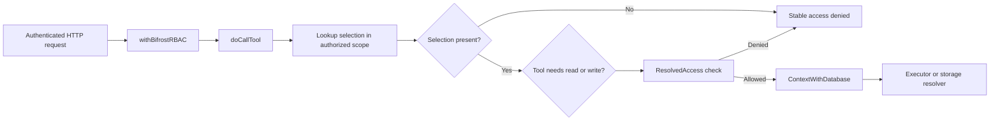
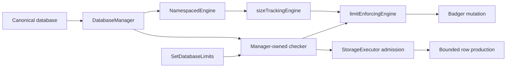
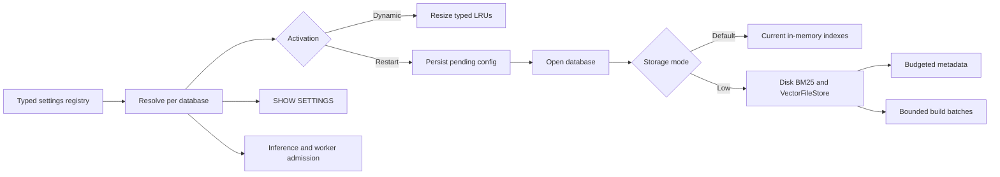
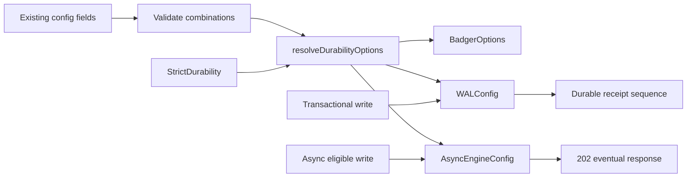
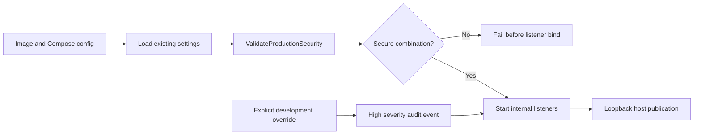
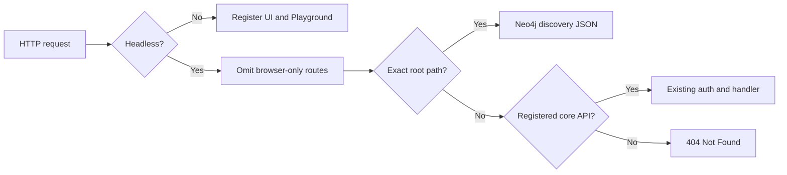

# NornicDB Isolation, Security, and Capacity Remediation Plan

## Goal

Harden NornicDB's authorization, resource isolation, durability, recovery,
inference activation, and container defaults. This document defines the
remaining remediations against current `main`; it does not implement them.

## Decision Principles

1. Enforce authenticated identity and database authorization at every protocol
   boundary.
2. Use a server-derived database scope. Do not trust a database name supplied
   by an MCP, GraphQL, HTTP, Bolt, or gRPC payload.
3. Fail closed when authentication is enabled and authorization state is absent
   or incomplete.
4. Bound memory, concurrency, result size, queues, and recovery working sets in
   production deployments.
5. Do not claim a durability or recovery guarantee until restore drills prove
   the corresponding recovery point and time objectives.
6. Make expensive inference and indexing behavior explicit in production.
7. Preserve backwards compatibility through warnings and opt-in compatibility
   modes, but make new production examples secure by default.

## Status Definitions

- **Fixed**: the controlling production path and regression tests are present on
  current `main`.
- **Partial**: useful controls exist, but defaults, wiring, or a material path
  remain unsafe or unbounded.
- **Open**: the controlling production path does not enforce the intended
  behavior.
- **Accepted constraint**: the limitation is documented and monitored rather
  than represented as a product guarantee.

## Current-Main Findings

| ID     | Finding                                                                                | Status                  | Current evidence                                                                                                                                                                                                                                         | Required disposition                                                                                                                            |
| ------ | -------------------------------------------------------------------------------------- | ----------------------- | -------------------------------------------------------------------------------------------------------------------------------------------------------------------------------------------------------------------------------------------------------- | ----------------------------------------------------------------------------------------------------------------------------------------------- |
| ISO-01 | MCP accepts a caller-selected database without per-database authorization              | **Fixed**               | MCP now derives the request database scope from authenticated RBAC context and rejects a caller-selected mismatch before executor or storage resolution                                                                                                  | Retain the cross-database MCP denial tests in the release gate                                                                                  |
| ISO-02 | GraphQL lacks per-database authorization                                               | **Fixed**               | `pkg/server/server_router.go` enriches GraphQL requests with RBAC; `pkg/graphql/resolvers/resolver.go` checks the database allowlist and mutation write privilege; denial tests exist                                                                    | Retain cross-database query and mutation regression tests in the release gate                                                                   |
| ISO-03 | Empty allowlists grant every database and missing privilege rows inherit global roles  | **Accepted constraint** | `pkg/auth/allowlist.go` defines empty as all; `pkg/auth/privileges.go` falls back to global permissions                                                                                                                                                  | Retain only as an explicit compatibility behavior; secure multi-database operation requires strict database policy                              |
| ISO-04 | Headless mode does not fully suppress the browser-only HTTP surface                    | **Fixed**               | `registerUIRoutes` omits SPA assets and `/auth/config`; `registerGraphQLRoutes` now omits `/graphql/playground`; `handleDiscovery` rejects non-root fallthrough paths; the headless route matrix preserves core APIs                                     | Retain the browser-route and core-API preservation regression test in the release gate                                                          |
| RES-01 | Per-database limits are implemented but not attached to production storage/query paths | **Partial**             | `DatabaseManager` now owns checker lifecycle, enforcing storage wrappers and database-scoped executors apply configured storage/query limits; startup streams exact byte reconciliation; Bolt has exact-once permits; inference resolves manager storage | Add periodic drift fault telemetry and define connection semantics for request-scoped HTTP/gRPC protocols                                       |
| RES-02 | Default database limits are unlimited                                                  | **Accepted constraint** | `pkg/multidb/limits.go` sets nodes, edges, bytes, query time, results, concurrency, connections, and rates to zero                                                                                                                                       | Preserve zero-as-unlimited compatibility; enforce each dimension only when an operator configures a nonzero per-database limit                  |
| RES-03 | Badger low-memory mode is not wired                                                    | **Fixed**               | `resolveBadgerOptions` maps restart-bound `storage.mode`; `default` preserves high-performance behavior and `low` selects `LowMemory=true`, while retaining configured cache limits                                                                      | Retain pure option-resolution and config validation tests                                                                                       |
| RES-04 | Vector and BM25 memory scale with corpus size                                          | **Partial**             | disk-backed vectors and HNSW vector lookup avoid one full vector copy, but search metadata, BM25 documents/postings, auxiliary vector maps, and startup builds remain memory-resident                                                                    | Add restart-bound per-database/per-index budgets and disk-backed low-memory implementations while retaining only bounded lookup metadata in RAM |
| RES-05 | Background inference can add unplanned CPU, GPU, memory, and graph growth              | **Partial**             | Heimdall, reranking, decay, and topology integration default off; embeddings default off, but auto-links and search startup warming default on, and Compose enables local embeddings, clustering, and Heimdall                                           | Require inference to be explicitly enabled per workload in production and enforce graph-growth quotas                                           |
| DUR-01 | Strict durability and WAL sync configuration are not applied to storage constructors   | **Partial**             | `resolveDurabilityOptions` validates and maps Badger, WAL, and async-write controls, with strict durability applied as the final override                                                                                                                | Add process-crash acknowledgement/recovery tests and expose effective durability in status output                                               |
| DUR-02 | Snapshot and corruption recovery have unbounded peak memory                            | **Partial**             | Automatic compaction writes atomic framed snapshots by streaming `StreamingEngine`; recovery validates CRC/footer and incrementally visits records; legacy JSON remains readable                                                                         | Restore directly into the production engine with a recovery memory budget instead of returning a fully materialized `MemoryEngine`              |
| DEP-01 | Container examples expose unauthenticated services broadly                             | **Partial**             | Base Compose files override images to enable auth and publish HTTP on loopback only; standalone images retain no-auth compatibility defaults but emit an ERROR event; production startup rejects insecure combinations                                   | Decide whether the standalone-image compatibility default is acceptable for release and retain structural/startup security tests                |

## Target Security Contract

NornicDB authenticates each principal and resolves its authorized database
scopes on the server. A client payload may omit a database or select an
authorized database, but cannot broaden or replace its server-derived access.
Every protocol uses the same authorization service and returns a stable
access-denied error before database existence, statistics, or timing can be
observed.

Empty allowlists and global privilege fallback remain explicit compatibility
behavior only. Secure multi-database mode must fail startup unless strict
database policy is enabled.

## Neo4j Settings and Cypher Administration Contract

Treat settings and administrative Cypher as a compatibility surface, not only
as parser syntax. Maintain a versioned conformance matrix against the supported
Neo4j release for settings, database administration, schema DDL, aliases,
users/roles, servers, transactions, procedures/functions, and all corresponding
`SHOW` commands. Each command marked supported must match Neo4j in:

- accepted grammar, parameters, expressions, `IF EXISTS`/`IF NOT EXISTS`,
  `OR REPLACE`, `YIELD`, `WHERE`, `RETURN`, ordering, pagination, and
  composability;
- required system/user database context, authorization checks, information
  filtering, and error precedence without existence disclosure;
- identifier normalization, duplicate handling, validation timing, error class
  and stable Neo4j-compatible code, idempotency, and atomic failure behavior;
- transactional visibility, auto-commit requirements, side effects, restart or
  asynchronous state transitions, notifications, counters, and result columns;
- Community/Enterprise availability and version-specific deprecation behavior.

Do not silently accept ignored clauses or report success for partial behavior.
An unsupported command, option, provider, topology operation, or Enterprise-only
feature fails before mutation with a stable unsupported-feature error. Implement
the smallest honest compatible subset first and expand the matrix command by
command using Neo4j parser and acceptance tests as executable references.

Settings use one typed registry as the source of truth for declaration,
startup parsing, runtime reads, mutation validation, redaction, authorization,
and documentation. Implement Neo4j-compatible `SHOW SETTING[S]`, including its
name/list/expression forms and standard columns: `name`, `description`, `value`,
`isDynamic`, `defaultValue`, `startupValue`, `validValues`,
`isExplicitlySet`, and `isDeprecated`. Default and `YIELD *` projections,
filtering, sorting, duplicate-name collapse, internal-setting exclusion, and
setting-level privilege filtering must match Neo4j.

Only settings declared dynamic may change at runtime. A Neo4j-compatible dynamic
configuration procedure is DBMS-scoped and changes the effective runtime value;
it must not be misrepresented as persisted per-database catalog metadata.
Startup/static values remain startup configuration and reject live mutation.
`ALTER DATABASE ... SET/REMOVE OPTION` is reserved for the bounded database
catalog-option contract implemented by Neo4j, not arbitrary `db.*` settings.

NornicDB-specific persisted per-database/index settings remain an explicit
extension backed internally by `_DbConfig` and written through the authenticated
typed admin API. They appear in the same read-only settings registry metadata,
but extension fields such as `configuredValue`, `effectiveValue`,
`pendingRestart`, and `restartLevel` are opt-in projections rather than changes
to Neo4j's default result shape. Do not add environment variables for these new
settings. Existing environment variables remain supported only as legacy global
startup sources. Reserve Neo4j setting names for behaviorally equivalent
settings; declare NornicDB-only settings under the `db.nornic.*` namespace.

Conformance tests must import or translate Neo4j's parser and acceptance cases
into table-driven tests, plus Bolt integration tests that compare records,
summaries, notifications, state changes, and failures against a pinned Neo4j
reference container. Record every intentional difference in the matrix with a
rationale and compatibility risk; absence from the matrix does not imply support.

## Ordered Workstreams

### 1. Close Protocol Authorization Gaps

**Priority:** P0, release blocking for any network-accessible deployment.

#### Exact code seams

| Existing seam                                                                                                                                                             | Exact change                                                                                                                                                                                                                                                                                                                                                                                                                                                                                                                                                                                                                                                                                           |
| ------------------------------------------------------------------------------------------------------------------------------------------------------------------------- | ------------------------------------------------------------------------------------------------------------------------------------------------------------------------------------------------------------------------------------------------------------------------------------------------------------------------------------------------------------------------------------------------------------------------------------------------------------------------------------------------------------------------------------------------------------------------------------------------------------------------------------------------------------------------------------------------------ |
| `pkg/auth/request_rbac_context.go`                                                                                                                                        | Add `RequestDatabaseScope` with unexported state and lookup methods: the authorized default database and a normalized selection-to-canonical map containing only database names and aliases the principal may access. Construct it with a defensive copy so callers cannot mutate request scope. This is resolved server-side metadata, not a second authorization policy. Missing scope fails closed when RBAC is enforced.                                                                                                                                                                                                                                                                           |
| `pkg/server/server_helpers.go`: `withBifrostRBAC`, `GetDatabaseAccessModeForRoles`, `GetResolvedAccessForRoles`; `pkg/multidb/manager.go`: `ListDatabases`, `ListAliases` | Extend `withBifrostRBAC` to build `RequestDatabaseScope` by filtering manager metadata through the existing `auth.DatabaseAccessMode`; attach the existing roles/access mode/read-write resolver unchanged. Reuse this enrichment on all MCP handler closures in `registerMCPRoutes`. Do not create an MCP-specific role or allowlist implementation.                                                                                                                                                                                                                                                                                                                                                  |
| `pkg/server/server_router.go`: `registerMCPRoutes`                                                                                                                        | Call `withBifrostRBAC` before `s.mcpServer.ServeHTTP`. Lower the outer `/mcp` and `/mcp/tools/call` gate from `PermWrite` to `PermRead`; otherwise read-only principals are rejected before the per-tool read/write decision. Health remains public and tool listing remains read-only.                                                                                                                                                                                                                                                                                                                                                                                                                |
| `pkg/mcp/server.go`: `doCallTool`, `extractDatabaseArg`                                                                                                                   | Replace the current direct `ContextWithDatabase(ctx, dbArg)` assignment with one `resolveAuthorizedToolRequest` call. For an omitted database, use the configured default when authorized; otherwise use the sole authorized standard database; when neither is unique, return a database-selection-required error. For an explicit name/alias, normalize and look it up only in the precomputed authorized selection map. Then check read/write through `RequestResolvedAccessResolverFromContext` and add the canonical database to context. A miss returns the same access-denied error for unauthorized, unknown, and unauthorized-alias inputs without calling `DatabaseManager.ResolveDatabase`. |
| `pkg/mcp/server.go`: tool dispatch in `doCallTool`                                                                                                                        | Add a closed `toolAccess` table keyed by the existing tool names. Classify `store`, `link`, and mutating task operations as write; classify retrieval/search operations as read. An unknown tool remains an unknown-tool error and never reaches a database resolver.                                                                                                                                                                                                                                                                                                                                                                                                                                  |
| `pkg/mcp/server.go`: `getExecutorAndGetNode`, `storageForContext`                                                                                                         | Add assertions that an authenticated request has an authorized database marker before invoking `DatabaseScopedExecutor` or `DatabaseScopedStorage`. These are defense-in-depth checks for direct/internal callers, not a second authorization policy.                                                                                                                                                                                                                                                                                                                                                                                                                                                  |
| `pkg/mcp/server_test.go`, `pkg/server/server_test.go`                                                                                                                     | Add resolver spies proving denials make zero executor/storage/database-manager calls. Cover omitted, multiple authorized databases, authorized alias, unauthorized alias, case normalization, `system`, unknown, missing-RBAC, read-only, and write cases at both `doCallTool` and the registered HTTP handler. Retain GraphQL tests and add the same handler-boundary context assertion there.                                                                                                                                                                                                                                                                                                        |

The local hypothesis is falsifiable: if every MCP path reaches
`resolveAuthorizedToolRequest` before `ContextWithDatabase`, and selection is
limited to the server-built scope map, a denied request cannot increment a
database resolver spy. The cheapest regression check is the focused MCP test
with executor and storage callbacks that fail the test when invoked.



Implementation tasks:

1. Add defensively copied request database scope to the authenticated context.
   Keep principal roles, allowlist mode, and resolved read/write access in the
   same context contract.
2. Change MCP HTTP registration to enrich the request with the shared RBAC
   context before entering `pkg/mcp`.
3. In MCP, resolve the effective database once from the authorized scope map.
   Accept an authorized canonical name or alias. For omission, choose the
   authorized configured default, else the sole authorized standard database;
   reject an ambiguous omission before `DatabaseScopedExecutor` or
   `DatabaseScopedStorage` is called.
4. Apply read/write authorization based on the tool operation, not the outer
   route's single global permission. `store`, `link`, and mutating task actions
   require database write access; retrieval actions require read access.
5. Audit every database-selecting HTTP, Bolt, Qdrant gRPC, Nornic gRPC,
   GraphQL, Heimdall, and plugin bridge through a table-driven protocol matrix.
6. Preserve GraphQL's current enforcement and add an integration test at the
   HTTP handler boundary so context-enrichment regressions are caught.

Test-first cases:

- MCP principal authorized for database A requests A: allowed.
- MCP principal authorized only for A omits database: routed to A. A principal
  authorized for A and B with no authorized configured default must select one.
- MCP principal authorized only for A requests B, an alias of B, `system`, an
  unknown database, or a case variant: same access-denied response and no
  resolver invocation.
- Read-only identity can call read tools but cannot perform writes.
- GraphQL query and mutation repeat the same cross-database denial matrix.
- Auth-enabled requests with missing claims, allowlist state, or privilege
  resolver fail closed.

Acceptance criteria:

- No protocol accepts a client-selected database outside its authenticated
  scope.
- Denied requests do not invoke database lookup, storage, search, embedding, or
  inference.
- Cross-database isolation tests pass under `go test -race`.
- Audit events include protocol, principal ID, bound scope, requested scope,
  operation, and decision without logging tokens or payload contents.

### 2. Wire Resource Enforcement End to End

**Priority:** P0 for noisy-neighbor and denial-of-service control.

#### Exact code seams

| Existing seam                                                                                                          | Exact change                                                                                                                                                                                                                                                                                                                                                                       |
| ---------------------------------------------------------------------------------------------------------------------- | ---------------------------------------------------------------------------------------------------------------------------------------------------------------------------------------------------------------------------------------------------------------------------------------------------------------------------------------------------------------------------------- |
| `pkg/multidb/manager.go`: `DatabaseManager`, `getStorageInternal`, `SetDatabaseLimits`                                 | Add a checker cache keyed by canonical database name. Construct the checker and enforcement wrapper once when constructing `NamespacedEngine`; use wrapper order `NamespacedEngine -> sizeTrackingEngine -> limitEnforcingEngine`. `SetDatabaseLimits` validates and copies limits, atomically replaces the checker state, and preserves counters/permits that are already active. |
| `pkg/multidb/enforcement.go`: `databaseLimitChecker`                                                                   | Stop snapshotting `info.Limits` into a checker that becomes stale. Store an atomically replaceable immutable limits value. Keep `CheckQueryLimits`, rate limiters, `ConnectionTracker`, and localized limit errors as the policy implementation. Replace `AllNodes`/`AllEdges` byte reconciliation with bounded storage iteration introduced by workstream 5.                      |
| New `pkg/multidb/limit_enforcing_engine.go`: `limitEnforcingEngine`                                                    | Implement the full `storage.Engine` surface by delegating reads and guarding create/update/delete/bulk mutations. Reserve count/byte/write-rate capacity before delegation; commit the tracked delta on success and release it on failure. Preserve optional interfaces by explicit delegation, following `storage_size_tracking_engine.go`.                                       |
| `pkg/cypher/executor.go`: `StorageExecutor` and `Execute` entry; row production helpers in the existing executor files | Inject a `multidb.LimitChecker` when the executor is created. Call query-rate and concurrent-query admission before parse/execute, defer permit release, run with the returned deadline context, and stop row production at `MaxResults`. Do not add checks to each protocol because all Cypher protocols converge here.                                                           |
| `cmd/nornicdb/main.go`: `ConfigureDatabaseExecutor`; `pkg/server/server_db.go`: database executor construction         | Pass the canonical database's manager-owned checker into each `StorageExecutor`. Direct storage users remain covered by `limitEnforcingEngine`; executor admission covers Cypher regardless of HTTP/Bolt entry.                                                                                                                                                                    |
| `pkg/bolt`, `pkg/server`, and gRPC server constructors                                                                 | Reuse one server-owned `multidb.ConnectionTracker`. Acquire only after the canonical database is known and release through `defer`/connection close exactly once. HTTP request rate limiting remains separate from database query limits.                                                                                                                                          |
| `pkg/multidb/manager_test.go`, new `limit_enforcing_engine_test.go`, and protocol integration tests                    | Test runtime limit replacement, reservation rollback, update byte deltas, delete release, bulk operations, cancellation, panic, and connection close. A shared conformance table runs the same mutations through direct storage and each protocol.                                                                                                                                 |

The implementation invariant is that all standard database engines returned by
`DatabaseManager.GetStorage` are enforcing engines, while all Cypher executors
use the same manager-owned checker. A direct `GetStorage` mutation test and a
direct `StorageExecutor.Execute` admission test disprove missing wrapper wiring
without requiring an end-to-end server.



Implementation tasks:

1. Make `DatabaseManager` own the lifecycle of one limit checker per canonical
   database and refresh it atomically when limits change.
2. Wrap namespaced storage with enforcement so node/edge/byte and write-rate
   checks cannot be bypassed by MCP, GraphQL, Cypher, Bolt, gRPC, plugins, bulk
   imports, or internal callbacks.
3. Inject query limits into every database-scoped executor. Enforce rate and
   concurrency before execution, cancellation deadlines during execution, and
   result caps while rows are produced rather than after full materialization.
4. Wire connection limits at Bolt, HTTP streaming/subscriptions, and gRPC
   admission points with guaranteed decrement on every close/error path.
5. Reconcile tracked byte usage at startup and periodically. Treat drift as an
   observable fault; do not silently reset usage to zero.
6. Preserve every zero-as-unlimited default. Apply a limit only when an
   operator configures a nonzero value for that database; recommend bounded
   production values from load tests without turning recommendations into
   implicit defaults.

Test-first cases:

- Each protocol is denied at the same node, edge, byte, write-rate, query-rate,
  query-time, result, concurrency, and connection boundary.
- Updates that increase entity size account only for the delta; deletes release
  quota; failed writes do not consume quota.
- Concurrent writes cannot exceed a limit through check-then-write races.
- Cancellation, panic, disconnect, and timeout release query and connection
  permits.
- Restart reconciliation restores accurate usage before accepting traffic.

Acceptance criteria:

- There is no production storage or executor construction path without a limit
  checker. With all-zero limits the checker is a behaviorally neutral fast
  path; configured nonzero dimensions are enforced.
- Limit overshoot under race testing is zero for count/concurrency limits and no
  more than one atomic write unit for byte accounting if reservation semantics
  require it.
- Limit rejection has stable machine codes and bounded-cardinality metrics.

### 3. Define Memory and Index Capacity Envelopes

**Priority:** P1, required before representative database load testing.

#### Exact code seams

| Existing seam                                                                                                                                     | Exact change                                                                                                                                                                                                                                                                                                                                                                                                                                                                                                                                |
| ------------------------------------------------------------------------------------------------------------------------------------------------- | ------------------------------------------------------------------------------------------------------------------------------------------------------------------------------------------------------------------------------------------------------------------------------------------------------------------------------------------------------------------------------------------------------------------------------------------------------------------------------------------------------------------------------------------- |
| `pkg/config/dbconfig/keys.go`: `KeyMeta`, `AllowedKeys`, `IsAllowedKey`, enum helpers                                                             | Replace `keyTuple`/`allowedKeysRaw` with `SettingDefinition` records. Each record owns canonical dotted name, legacy `_DbConfig` key, parser, default source, scope, dynamic flag, restart level, zero semantics, redaction, and valid values. Generate the existing admin key response from this registry during migration.                                                                                                                                                                                                                |
| `pkg/config/dbconfig/resolver.go`: `ResolvedDbConfig`, `Resolve`, `applyOverride`                                                                 | Add typed cache and independent BM25/vector/metadata budget fields for logical databases and indexes. Resolve canonical persisted names first, migrate legacy keys deterministically, and retain the current built-in/global/per-database/CLI precedence. Remove direct environment reads from resolution where the loaded global config already owns that source; add no environment aliases. Physical Badger mode/cache values come from the DBMS startup registry, not `_DbConfig`, while one engine is shared by namespaces.            |
| `pkg/server/server_dbconfig.go`: config PUT handler and `ResetSearchService` call                                                                 | Split registry entries by activation. Apply dynamic cache size/TTL through cache resize methods. Persist static settings but leave the running service unchanged and return configured/effective values plus `pendingRestart`; call `ResetSearchService` only for existing settings whose declared contract remains dynamic.                                                                                                                                                                                                                |
| `pkg/cypher` administrative dispatch and settings result production                                                                               | Add `SHOW SETTING`/`SHOW SETTINGS` dispatch backed by the same registry. Keep Neo4j's default columns exact; expose NornicDB restart/configured-value fields only when explicitly yielded. Do not route arbitrary settings through `ALTER DATABASE ... SET OPTION`.                                                                                                                                                                                                                                                                         |
| `pkg/nornicdb/db.go`: `Open` and Badger options construction                                                                                      | Add physical storage mode/cache fields to the existing `config.Config` startup model and replace hardcoded `HighPerformance: true`, `LowMemory: false` with a pure `resolveBadgerOptions` helper. `default` returns today's values; `low` returns `LowMemory=true` and `HighPerformance=false`; both preserve existing node and edge-type cache limits. Test this helper without opening Badger.                                                                                                                                            |
| `pkg/search/search.go`: `NewServiceWithDimensionsAndBM25Engine`, `resultCache`, `ensureBuildVectorFileStore`, `BuildIndexes`, persistence writers | Add `ServiceOptions` carrying database ID, cache policy, storage policy, and three independent index budgets. Replace the hardcoded `newSearchResultCache(1000, 5*time.Minute)`. In low-memory mode require configured index paths, open disk readers before build, and account every resident metadata allocation and build batch against its own budget.                                                                                                                                                                                  |
| `pkg/search/fulltext_index.go`, `fulltext_index_v2.go`, `fulltext_index_v2_persist.go`                                                            | Add a `bm25Index` disk implementation using the existing persisted generation/version lifecycle. Stream postings and source-text records into a temporary generation, retain only dictionary/offset/document-stat metadata in bounded RAM, validate, then atomically publish. Keep v1/v2 ranking behavior and persistence compatibility tests.                                                                                                                                                                                              |
| `pkg/search/vector_file_store.go`, `vector_index.go`, `hnsw_index.go`, vector build pipeline                                                      | In low-memory mode make `VectorFileStore` the sole vector-payload owner. Store IDs/offsets and compact HNSW adjacency in RAM; use the existing vector lookup callback for distance evaluation. Remove payload copies from `VectorIndex`, clustering input, GPU staging, and rebuild snapshots by using bounded batches.                                                                                                                                                                                                                     |
| `pkg/cypher/executor.go`: `NewStorageExecutor`, `SmartQueryCache`, `QueryPlanCache`, Fabric plan cache, `QueryAnalyzer`, and current lookup maps  | Add `ExecutorOptions` plus `NewStorageExecutorWithOptions`; keep `NewStorageExecutor` as a compatibility constructor that supplies today's 1000/500/500/1000 and existing lookup-map bounds. Convert the current reset-on-cap maps (`nodeLookupCache`, vector-query embeddings, unwind plans, uppercase routing, and syntax validation) to bounded LRU/clock caches under the lookup-metadata policy. Keep transactional lookup caches isolated as today.                                                                                   |
| `pkg/search/search.go`: `searchResultCache`; Cypher cache types in `pkg/cypher/cache.go`                                                          | Add in-place `Resize` and `SetTTL` methods to the existing typed caches instead of creating one shared cache. Cache keys include canonical database and all result-affecting inputs. Shrink evicts LRU entries, zero disables, growth preserves entries, and TTL changes remove entries already older than the new TTL.                                                                                                                                                                                                                     |
| `pkg/storage/badger_transaction.go`: `BadgerTransaction`, mutation methods, `Commit`, `Rollback`; `pkg/multidb` manager-owned accounting          | Add a storage-level namespace/delta reservation callback to `BadgerEngine` so storage does not import `multidb`. Reserve the encoded delta whenever pending node/edge/write/delete maps grow or replace a value; release on replacement, rollback, failed commit, and successful close. `DatabaseManager` owns the per-canonical-database aggregate counter and enforces `db.memory.transaction.total.max` across all active transactions. Attach accounting when `SetNamespace` pins the transaction; reject cross-namespace use as today. |
| `pkg/nornicdb/inference_services.go`: `getOrCreateInferenceService`; `auto_embed_inference.go`: `onNodeEmbedded`, `runInferenceForEmbeddedNode`   | Resolve auto-link/topology activation from the same per-database typed settings before creating or invoking an inference engine. Add a database-storage resolver on `DB`, wired in `cmd/nornicdb.ConfigureDatabaseExecutor` from `DatabaseManager.GetStorage`; use it for generated edges instead of constructing `storage.NewNamespacedEngine(db.baseStorage, dbName)`, which bypasses the manager's enforcement wrapper. Return and record quota/write failures instead of discarding `CreateEdge` errors.                                |
| `pkg/nornicdb/embed_queue.go` and search clustering/reranker startup in `search_services.go`                                                      | Gate worker creation, k-means timers/build triggers, and reranker attachment with the resolved database settings. Existing global values remain fallback defaults. Dynamic disable stops future admission and drains/cancels through existing component close/reset methods; static index representation changes retain the restart semantics above.                                                                                                                                                                                        |
| `pkg/config/dbconfig/*_test.go`, new `pkg/server/server_dbconfig_capacity_test.go`, `pkg/search/*_test.go`, `pkg/cypher/*cache*_test.go`          | Add default-compatibility snapshots, typed parsing, pending-restart, independent-budget, bounded-build, restart, ranking parity, cache-key isolation, resize, and invalidation tests. Heap benchmarks assert growth against fixture-independent bounds rather than exact allocator bytes.                                                                                                                                                                                                                                                   |

The discriminating default-compatibility check constructs services with an
empty new configuration and compares resolved options to today's constants.
The low-memory check builds a corpus larger than its deterministic heap budget,
then proves vectors/postings are fetched from disk and ranked results match the
unrestricted implementation.



**Compatibility decision:** preserve all current default values and behavior.
NornicDB continues to use memory as it does today unless an operator explicitly
sets low-memory mode or a capacity setting. Capacity ceilings use `0` to mean
unlimited. Existing defaults for cache entry counts, cache TTLs, enabled indexes,
and startup warming remain unchanged; `0` must not be substituted for those
existing defaults where it currently means disabled.

Neo4j comparison, verified against the local `~/src/neo4j` source:

- `server.memory.query_cache.per_db_cache_num_entries` is database-scoped,
  defaults to 1000 entries, accepts zero, and is dynamic. "Per database" means
  Neo4j allocates that many entries to each database, not that the value is
  independently stored as metadata on every named database.
- `db.memory.transaction.total.max` is database-scoped, byte-valued, uses binary
  unit suffixes, uses zero for unlimited, and is dynamic. It is likewise a
  registered DBMS configuration value applied to each database.
- `server.memory.pagecache.size` is a static DBMS-level byte setting, not a
  per-database or per-index budget.
- Neo4j declares settings in a typed registry. `SHOW SETTINGS` reads current,
  default, and startup values plus dynamic, valid-value, explicit, deprecated,
  description, and authorization metadata from that registry.
- Neo4j runtime mutation changes only declared dynamic settings. It is not an
  arbitrary persisted metadata map attached to a named database.
- `ALTER DATABASE ... SET/REMOVE OPTION` manages bounded catalog options; it is
  not the generic write API for `db.*` settings.
- Neo4j does not expose a per-index resident-memory ceiling equivalent to the
  BM25/vector controls required here. Those controls are NornicDB extensions,
  but must use the same setting metadata, binary-size parsing, effective-value,
  and static/dynamic conventions.

#### Configuration Contract

Use Neo4j-style dotted setting IDs in the central registry and Cypher read API.
Do not add environment variables for new per-database/index settings. Existing
`NORNICDB_*` variables remain legacy global startup inputs. Persist logical
database/index values in `_DbConfig` through the authenticated typed admin API.
Physical-engine values are startup YAML/CLI settings in the same registry and
are not stored per namespace. This is a documented extension, not Neo4j's
mutation contract.

| Canonical setting                                      | Existing legacy global source               | Scope                                  | Default                                         | Activation                                         |
| ------------------------------------------------------ | ------------------------------------------- | -------------------------------------- | ----------------------------------------------- | -------------------------------------------------- |
| `server.memory.query_cache.per_db_cache_num_entries`   | `NORNICDB_QUERY_CACHE_SIZE`                 | Per database instance                  | Existing 1000 entries                           | Dynamic                                            |
| `db.nornic.query_cache.ttl`                            | `NORNICDB_QUERY_CACHE_TTL`                  | Per database instance                  | Existing 5 minutes                              | Dynamic                                            |
| `db.nornic.query_plan_cache.max_entries`               | None                                        | Per database instance                  | Existing 500 entries                            | Dynamic                                            |
| `db.nornic.fabric_plan_cache.max_entries`              | None                                        | Per database instance                  | Existing 500 entries                            | Dynamic                                            |
| `db.nornic.query_analysis_cache.max_entries`           | None                                        | Per database instance                  | Existing 1000 entries                           | Dynamic                                            |
| `db.nornic.search_result_cache.max_entries`            | None                                        | Per database instance                  | Existing 1000 entries                           | Dynamic                                            |
| `db.nornic.query_lookup_metadata.max_entries`          | None                                        | Per database instance                  | Existing per-cache bounds                       | Dynamic                                            |
| `db.memory.transaction.total.max`                      | None                                        | Per database                           | `0` (unlimited)                                 | Dynamic when transaction accounting is implemented |
| `db.nornic.memory.storage.mode`                        | None                                        | Per physical database engine           | `default`, preserving high-performance behavior | Restart                                            |
| `db.nornic.memory.storage.node_cache.max_entries`      | `NORNICDB_BADGER_NODE_CACHE_MAX_ENTRIES`    | Per physical database engine           | Existing 10000 entries                          | Restart                                            |
| `db.nornic.memory.storage.edge_type_cache.max_entries` | `NORNICDB_BADGER_EDGE_TYPE_CACHE_MAX_TYPES` | Per physical database engine           | Existing 50 types                               | Restart                                            |
| `db.nornic.memory.index.bm25.max`                      | None                                        | Per database, BM25 index               | `0` (unlimited/current representation)          | Restart/rebuild                                    |
| `db.nornic.memory.index.vector.max`                    | None                                        | Per database, vector index             | `0` (unlimited/current representation)          | Restart/rebuild                                    |
| `db.nornic.memory.index.metadata.max`                  | None                                        | Per database, per index implementation | `0` (unlimited/current representation)          | Restart/rebuild                                    |
| `db.nornic.index.bm25.storage`                         | None                                        | Per database, BM25 index               | `memory`/current behavior                       | Restart/rebuild                                    |
| `db.nornic.index.vector.storage`                       | None                                        | Per database, vector index             | current automatic behavior                      | Restart/rebuild                                    |

The API accepts raw bytes or case-insensitive binary suffixes compatible with
Neo4j (`k`, `m`, `g`, `t`, interpreted as KiB, MiB, GiB, TiB). It serializes
effective values as bytes plus a human-readable form. Negative values are
invalid. A zero capacity ceiling means unlimited; it does not enable low-memory
mode, disable an index, change warming, or alter a cache's established default.

Badger serves one physical engine with namespaced logical databases. Its mode
and internal caches therefore cannot be truthfully enforced per namespace. The
current process shares one engine across logical databases, so these fields are
DBMS startup settings even though Nornic extensions retain the required
`db.nornic.*` prefix. Status reports them once for the physical engine and must
not claim per-database Badger isolation.

Index budgets are independent. A BM25 budget cannot be borrowed by the vector
index, and neither can silently consume a query-cache budget. Each index reports
resident bytes, disk bytes, budget, implementation, build working-set peak, and
whether it is within budget. `db.nornic.memory.index.metadata.max` applies separately
to each enabled index rather than as one shared pool.

#### Low-Memory Behavior

Low-memory mode changes representation and working-set retention, not database
features or default capacity limits:

1. Wire `db.nornic.memory.storage.mode=low` to
   `BadgerOptions.LowMemory=true` and
   `HighPerformance=false`. Wire `default` to today's exact constructor values.
   Never enable both flags. Pass the existing Badger node and edge-type cache
   knobs in both modes rather than replacing operator values with hidden mode
   defaults.
2. Keep graph records, BM25 payloads/postings, and vector payloads on disk.
   Reuse the existing per-database index paths, `VectorFileStore`, HNSW
   `VectorLookup`, index versioning, WAL-consistent rebuild, and atomic
   persistence paths so the memory and disk implementations cannot diverge.
3. Permit only the minimal bounded metadata required for lookup and graph
   traversal in RAM: IDs/offsets, compact HNSW adjacency, document statistics,
   and bounded label/type maps. Payloads must be fetched from disk on demand.
4. Build and rebuild indexes as bounded streaming batches directly into their
   disk representation. Do not first construct a complete in-memory index, and
   do not retain old and replacement payloads concurrently. Publish the new
   generation atomically after validation.
5. Retain only recently repeated queries and search responses in memory. Reuse
   the existing LRU eviction and TTL semantics; key by database plus normalized
   query, parameters, locale, and result-affecting options. A write invalidates
   only affected database caches.
6. Map `server.memory.query_cache.per_db_cache_num_entries` and
   `db.nornic.query_cache.ttl` to the existing per-database `SmartQueryCache`.
   Do not apply that one count to structurally different caches. Expose separate
   Nornic settings for the existing 500-entry parsed-plan/Fabric caches,
   1000-entry analyzer/search-response caches, and bounded lookup metadata.
   Share configuration and metrics, not cached values or entry types. Preserve
   every current default and correctness-specific invalidation rule.
7. Resizing an LRU cache is the only live memory-envelope change in this
   workstream. Shrinking evicts least-recently-used entries immediately;
   setting entry count to zero disables that cache; growing preserves existing
   entries; TTL changes apply to new entries and may eagerly remove entries
   already older than the new TTL.

Minimal metadata is still charged to its per-index metadata budget. If an index
cannot open within a nonzero budget, startup/rebuild fails for that index with a
capacity error; it must not silently switch representation, truncate coverage,
or change result quality. A zero budget preserves today's unrestricted behavior.

#### Restart and Change Semantics

Match Neo4j's distinction between explicitly dynamic settings and static
settings. Query-cache entry count/TTL and transaction-memory admission are
dynamic. Badger mode/cache settings, index storage selection, and index memory
budgets are static because they select on-disk structures and build algorithms.

`PUT /admin/databases/{db}/config` persists static changes but must not call
`ResetSearchService` or trigger an immediate rebuild. It returns
`pendingRestart: true` with the old effective runtime value and new configured
value. Apply the setting when that database is next opened. If NornicDB later
supports independently stopping/starting a logical database, that database
restart is sufficient for index settings; physical Badger settings require a
process/physical-engine restart. Failed reopen leaves the previous index
generation intact and reports the database/index unavailable rather than
falling back to unrestricted memory use.

#### Implementation Tasks

1. Replace the positional `dbconfig.KeyMeta` list with one typed settings
   registry containing canonical name, description, parser/type, valid values,
   default, scope, dynamic flag, restart level, zero semantics, deprecation, and
   any existing legacy source. Reuse it for startup parsing, config resolution,
   admin validation, and `SHOW SETTINGS` so behavior and metadata cannot drift.
2. Add byte-size parsing compatible with Neo4j and persist normalized values in
   `_DbConfig`. Do not add new environment variables. Keep current precedence
   for existing sources: built-in, file/environment global, per-database
   persisted override, explicit CLI emergency override.
3. Add physical storage mode/cache fields to the existing DBMS startup
   `config.Config` and wire them into `pkg/nornicdb.Open`'s Badger constructor.
   Do not persist these physical-engine settings in per-namespace `_DbConfig`.
   Add startup validation and regression tests that inspect resolved options.
4. Replace hardcoded plan, Cypher-result, and search-result cache constructors
   with a per-database cache factory driven by the existing LRU size/TTL knobs.
5. Implement a disk-backed BM25 reader/writer and bounded build path. Reuse the
   existing persisted format lifecycle where possible; retain source text only
   on disk when required for removal, update, prefix expansion, or explanation.
6. Complete the vector disk path so vector payloads are never duplicated in
   `VectorIndex`, HNSW, clustering, GPU staging, or rebuild snapshots in
   low-memory mode. Bound each temporary batch.
7. Add per-index resident-memory accounting and admission around metadata and
   build buffers. Do not infer mode or budgets from Go's process soft limit.
8. Expose effective/configured settings, pending restart state, cache
   hit/miss/eviction metrics, index resident/disk bytes, and rebuild peak bytes
   with database and index labels of bounded cardinality.
9. Route every embedding, auto-link, topology, clustering, and reranking action
   through resolved per-database activation. Background graph writes obtain
   storage from `DatabaseManager.GetStorage` so count/byte/write-rate limits
   apply identically to foreground writes. Preserve all current global defaults
   when no per-database override exists.

#### Test-First Cases

- With no new settings, constructor options, cache sizes/TTLs, index enablement,
  warming, build behavior, and query results are byte-for-byte/current-value
  compatible with today's defaults.
- Low-memory opens Badger with `LowMemory=true`, `HighPerformance=false`, and
  the configured existing cache entry limits; default mode preserves today's
  `HighPerformance=true`, `LowMemory=false`.
- Repeated identical queries hit the correct database's LRU; distinct params,
  locale, database, or result-affecting options do not collide; LRU/TTL eviction
  and write invalidation remain correct.
- Existing executor caches retain their individual 1000/500/500/1000 defaults;
  configuring one cache does not resize a different cache type. Lookup metadata
  remains bounded under adversarial unique-query and unique-key workloads.
- Concurrent explicit and implicit transactions share the database transaction
  memory ceiling; replacement charges deltas, and commit/rollback/error paths
  return all reservations.
- Disabling inference for A does not affect B. Auto-generated edges use A's
  enforcing engine, stop at A's edge/byte/write-rate limits, and surface a
  bounded error/metric instead of silently growing the graph.
- BM25/vector low-memory builds remain below a small deterministic working-set
  bound, survive restart, and return the same ranked IDs/scores as unrestricted
  mode within documented floating-point tolerance.
- Independent BM25, vector, and metadata budgets reject only the affected index
  and never borrow from one another.
- Static admin changes persist and report pending restart without rebuilding;
  dynamic LRU changes apply immediately; reopen applies static settings.
- Existing global environment variables retain their current effective values.
  New database/index settings use the persisted typed API without environment
  aliases, and legacy `_DbConfig` keys migrate deterministically to canonical
  dotted names.
- `SHOW SETTINGS` default columns and `YIELD *` match Neo4j's names, types,
  filtering, authorization, and current/default/startup value semantics.

#### Acceptance Criteria

- Unset settings produce no overall behavior or default-value change.
- Low-memory index payload/posting residency is disk-backed; RAM growth is
  limited to configured LRU caches, bounded build batches, and budgeted minimal
  lookup/graph metadata.
- A database larger than available RAM can build, restart, and query both BM25
  and vector indexes successfully in low-memory mode.
- Every database/index reports its own configured/effective budget and actual
  resident/disk usage; zero is reported explicitly as unlimited.
- Static settings take effect only after the documented database or physical
  engine restart and never cause an implicit rebuild from the config PUT path.
- Capacity benchmarks and heap profiles cover startup, steady state, rebuild,
  repeated-query cache hits, cache churn, and peak query load using deterministic
  fixtures. Search quality and latency deltas are documented before merge.

### 4. Wire the Existing Durability Contract

**Priority:** P1, required before NornicDB is treated as a durable authority.

#### Exact code seams

| Existing seam                                                                                 | Exact change                                                                                                                                                                                                                                                                                                     |
| --------------------------------------------------------------------------------------------- | ---------------------------------------------------------------------------------------------------------------------------------------------------------------------------------------------------------------------------------------------------------------------------------------------------------------- |
| `pkg/config/config.go`: existing database durability and async-write fields                   | Add cross-field validation only: WAL mode is `none`, `batch`, or `immediate`; batch interval is positive when active; pending-cache maxima are nonnegative. Preserve every current default and existing input name.                                                                                              |
| `pkg/nornicdb/db.go`: Badger, WAL, and async-engine construction                              | Add a pure `resolveDurabilityOptions` helper returning `storage.BadgerOptions`, `storage.WALConfig`, and `storage.AsyncEngineConfig`. Map existing fields once. Apply `StrictDurability` last as the documented override: Badger sync writes, immediate WAL sync, inactive batch interval, and 10ms async flush. |
| `pkg/storage/wal.go`: `WALConfig` and append/sync path                                        | Reuse current sync implementations. Add injected file/sync hooks only in tests where needed to deterministically surface failed flush/fsync; do not add another durability mode or sequence.                                                                                                                     |
| `pkg/storage/async_engine.go`: existing close/flush logic                                     | Preserve final-drain and retained-failure behavior. Ensure `db.Close` returns the async close error rather than logging and discarding it, and add tests for underlying close failure after a successful drain.                                                                                                  |
| Existing HTTP mutation response/receipt production in `pkg/server`                            | Leave `202` eventual and transactional receipt shapes intact. Add effective durability fields to status/admin output and startup logs; never label them as a profile. Crash assertions correlate recovered WAL sequence bounds with the existing receipt.                                                        |
| `pkg/nornicdb/*test.go`, `pkg/storage/wal_test.go`, async-engine tests, process crash harness | Add table-driven constructor mapping first, then subprocess kill tests for each WAL mode and eventual/transactional response path. Inject disk-full, sync, truncation, critical/noncritical corruption, and rename failures.                                                                                     |

The cheapest falsification is a table test of `resolveDurabilityOptions`; any
setting that does not reach the existing constructor types fails before costly
crash tests run.



Do not add named `cache`, `balanced`, or `strict` profiles. Reuse the existing
orthogonal controls and preserve their current defaults:

| Existing control                                  | Current default    | Contract                                                                                                                   |
| ------------------------------------------------- | ------------------ | -------------------------------------------------------------------------------------------------------------------------- |
| `WALSyncMode`                                     | `batch`            | `none` flushes userspace buffers without fsync; `batch` fsyncs every `WALSyncInterval`; `immediate` fsyncs each WAL append |
| `WALSyncInterval`                                 | `100ms`            | Applies only to `batch`; bounds the normal host-crash exposure after a write reaches the WAL                               |
| `StrictDurability`                                | `false`            | Existing convenience override: immediate WAL sync, Badger `SyncWrites=true`, and the documented 10ms async flush interval  |
| `AsyncWritesEnabled`                              | `true`             | Enables the existing write-behind engine only for eligible operations; it does not change durable transactional paths      |
| `AsyncFlushInterval`                              | `50ms`             | Controls normal write-behind visibility/persistence latency                                                                |
| `AsyncMaxNodeCacheSize` / `AsyncMaxEdgeCacheSize` | `50000` / `100000` | Existing bounded pending-write caches; reaching a nonzero limit forces a synchronous flush                                 |

Keep the existing acknowledgement distinction. Async-eligible operations return
`202 Accepted`, `X-NornicDB-Consistency: eventual`, and optimistic metadata;
they do not receive a durable receipt and may be lost before the async cache is
flushed. Mutations on the transactional path return `200 OK` with the existing
receipt containing WAL sequence bounds. `WALSyncMode` controls the durability of
writes after they reach the WAL; it must not be described as protecting an
unflushed async write.

`StrictDurability=true` must implement the behavior already documented by
NornicDB rather than silently creating a new write-consistency mode. If an
operator requires every successful mutation response to represent durable
completion, they also set the existing `AsyncWritesEnabled=false`; strict mode
alone may still return `202` for an eligible eventual operation. Do not add a
shutdown-deadline setting in this workstream: `AsyncEngine.Close()` already
performs a final flush, retains failed items, and returns an explicit error when
data remains unflushed.

Implementation tasks:

1. Validate `WALSyncMode` as exactly `none`, `batch`, or `immediate`; require a
   positive `WALSyncInterval` for `batch` and treat the interval as inactive for
   the other modes. Preserve the existing defaults when fields are unset.
2. Apply `WALSyncMode` and `WALSyncInterval` to `WALConfig.SyncMode` and
   `WALConfig.BatchSyncInterval`. Apply `StrictDurability` to the existing
   documented overrides: immediate WAL sync, zero inactive interval, Badger
   `SyncWrites=true`, and 10ms async flush interval. Do not add configuration
   keys or environment variables.
3. Expose the effective values of the existing controls through status/admin
   output and startup logs without labeling a synthesized profile.
4. Reuse WAL sequence bounds and the existing durable receipt to compare
   acknowledged transactional writes with recovered writes after forced
   termination. Use existing optimistic metadata to identify eventual writes;
   do not introduce a second mutation sequence ID.
5. Test process kill, truncated WAL, corrupt noncritical embedding records,
   corrupt critical mutations, disk full, failed fsync, and snapshot rename
   interruption.
6. Test shutdown through the existing `AsyncEngine.Close()` contract: successful
   final drain, retained failed entries, propagated flush error, and underlying
   close error. Do not convert a failed drain into a successful shutdown.

Acceptance criteria:

- Constructor tests prove every existing setting reaches `BadgerOptions`,
  `WALConfig`, or `AsyncEngineConfig` with unchanged defaults.
- Crash tests cover the `none`, `batch`, and `immediate` WAL modes on Linux and
  macOS filesystems used in CI/release qualification. Assertions distinguish
  durable receipts from eventual `202` responses.
- `StrictDurability=true` always resolves to immediate WAL sync, Badger
  `SyncWrites=true`, and the documented async flush interval. Combining it with
  `AsyncWritesEnabled=false` permits no eventual response path.
- Shutdown either drains accepted async writes or returns the existing explicit
  incomplete-flush/close failure.

### 5. Stream Snapshots and Recovery

**Priority:** P1 for large databases and bounded restart behavior.

#### Configuration contract

Add `db.nornic.recovery.batch.max_bytes` and
`db.nornic.recovery.memory.max` to the typed registry. They are DBMS-scoped,
startup/static YAML or CLI settings with no new environment aliases. Zero keeps
the current unrestricted compatibility contract. A nonzero batch limit caps
decoded records plus pending Badger writes per flush; a nonzero memory limit is
an admission ceiling covering buffers, checksum state, and the active batch.
Snapshot/recovery rejects a single record larger than either active ceiling.
Streaming is used even when both values are zero, so the implementation no
longer allocates slices proportional to the full corpus.

#### Exact code seams

| Existing seam                                                                                                                                                                                                | Exact change                                                                                                                                                                                                                                                                                                                                                                                                                     |
| ------------------------------------------------------------------------------------------------------------------------------------------------------------------------------------------------------------ | -------------------------------------------------------------------------------------------------------------------------------------------------------------------------------------------------------------------------------------------------------------------------------------------------------------------------------------------------------------------------------------------------------------------------------- |
| `pkg/storage/types.go`: existing `StreamingEngine`; `pkg/storage/badger_stats.go`, `namespaced.go`, `wal_engine.go`, `async_engine.go`, `composite_engine.go`; `pkg/multidb/storage_size_tracking_engine.go` | Reuse the existing `StreamNodes`/`StreamEdges` contract and current production implementations. Snapshot, recovery, and quota reconciliation require `storage.StreamingEngine` and return an explicit unsupported error when absent. Do not call `StreamNodesWithFallback`/`StreamEdgesWithFallback` in these bounded paths because their fallback materializes `AllNodes`/`AllEdges`.                                           |
| `pkg/storage/wal.go`: `Snapshot`, `WAL.CreateSnapshot`, `SaveSnapshot`, `LoadSnapshot`                                                                                                                       | Keep these JSON APIs as the legacy reader/writer compatibility surface. Add `WriteSnapshot(engine, io.Writer, SnapshotOptions)` and `ReadSnapshot(io.Reader, SnapshotVisitor)`. The new framed format writes header/version/sequence, node and edge records with checksums, and a completion footer; a missing/invalid footer is never eligible.                                                                                 |
| `pkg/storage/wal.go`: `RecoverFromWALWithResult`, replay helpers                                                                                                                                             | Extract replay into `ReplayWALInto(engine, walDir, afterSequence)` so recovery targets any engine. Stream a snapshot into the target engine in bounded batches, then replay entries after its sequence boundary. Retain `RecoverFromWALWithResult` as a legacy memory-engine wrapper until callers migrate.                                                                                                                      |
| `pkg/nornicdb/storage_recovery.go`: `recoverBadgerFromSnapshotAndWAL`                                                                                                                                        | Preflight, preserve the source directory, create the fresh Badger target, stream the selected snapshot directly into it, replay WAL directly into it, validate, then return it. Delete the current `MemoryEngine -> AllNodes/AllEdges -> bulk restore` path. On failure, close the target and leave preserved source data untouched.                                                                                             |
| `pkg/nornicdb/db_admin.go`: backup/restore methods using `AllNodes`/`AllEdges`                                                                                                                               | Route large storage-level backup/restore through the framed streaming API. Keep JSON logical export as a separately named compatibility/export path; do not advertise it as bounded recovery.                                                                                                                                                                                                                                    |
| `pkg/nornicdb/storage_recovery.go`: candidate selection and preservation                                                                                                                                     | Select only files whose header/footer/checksum verify. Preflight target plus preservation capacity before rename. Add preservation path and the two recovery ceilings to existing typed YAML/CLI configuration only, with no new environment variable. Keep the bind-mount `EBUSY` child-move fallback.                                                                                                                          |
| `pkg/storage/wal_test.go`, `wal_compaction_test.go`, `pkg/nornicdb/storage_recovery_test.go`                                                                                                                 | Test bounded batch size, early-stop/error propagation, mixed legacy/new candidates, partial footer, checksum mismatch, exact sequence cutoff, namespace preservation, target validation, disk preflight, and rollback/preservation failures. A guard engine implements `StreamingEngine` and makes `AllNodes`/`AllEdges` panic to prove the new path streams; a non-streaming engine must return the explicit unsupported error. |

The guard-engine test is the cheap discriminator: snapshot and recovery pass
only if no materializing API is touched. Peak-heap subprocess tests then prove
the bound across increasing corpus sizes.


Implementation tasks:

1. Introduce a versioned streaming snapshot format with header, framed records,
   checksums, completion footer, and sequence boundary. Keep a reader for the
   current JSON snapshot format during migration.
2. Stream storage records directly to the temporary snapshot file rather than
   constructing `Snapshot.Nodes` and `Snapshot.Edges` slices.
3. Restore directly into a fresh Badger engine in bounded batches while replaying
   WAL entries after the snapshot sequence. Avoid a full intermediate memory
   engine and full entity slices.
4. Add configurable batch size and recovery memory ceiling. Emit progress by
   records/bytes with bounded metric labels.
5. Preserve the corrupted source directory as today, but preflight free disk
   space and support an operator-selected preservation path for bind mounts.
6. Only mark a recovered database online after counts, checksums, namespace
   invariants, and required indexes have been validated. Rebuild regenerable
   search artifacts after storage is online.

Migration and compatibility:

- New releases read JSON and streaming snapshots but write only the new format.
- Retain at least one last-known-good snapshot readable by the previous release
  until rollback is no longer allowed.
- Add an offline snapshot conversion/verification command before removing JSON
  read support in a later major release.

Acceptance criteria:

- Snapshot and restore peak additional heap is bounded by the configured batch
  budget and does not scale linearly with database size.
- Recovery of a dataset larger than process memory completes successfully.
- Interrupted snapshots are never selected as recovery candidates.
- Recovery point and time objectives are measured on the maximum supported
  database fixture.

### 6. Secure Container and Network Defaults

**Priority:** P0 for published examples and images.

#### Exact code seams

| Existing seam                                                                                                 | Exact change                                                                                                                                                                                                                                                                                                 |
| ------------------------------------------------------------------------------------------------------------- | ------------------------------------------------------------------------------------------------------------------------------------------------------------------------------------------------------------------------------------------------------------------------------------------------------------ |
| `docker/Dockerfile.*` environment blocks                                                                      | Change every maintained image's baked `NORNICDB_NO_AUTH=true` to `false`. Keep container listeners on all interfaces internally; image defaults alone must not publish ports.                                                                                                                                |
| `docker-compose.yml`, `docker-compose.amd64.yml`, `docker-compose.arm64.yml`, maintained accelerator variants | Remove `${NORNICDB_NO_AUTH:-true}` and publish the required HTTP port as `127.0.0.1:7474:7474`. Remove Bolt/Qdrant host publication from the base example. Put broad publication and no-auth only in an explicitly named development override file.                                                          |
| `docker/entrypoint.sh`                                                                                        | Keep explicit `NORNICDB_NO_AUTH=true` support, but emit one high-severity structured startup event when selected. Do not silently add `--no-auth`; preserve the explicit argument construction.                                                                                                              |
| `pkg/config/config.go`: environment/security fields; `cmd/nornicdb/main.go`: startup before listeners         | Add `ValidateProductionSecurity(config)` using existing environment, auth, CORS, HTTP/TLS, and listener settings. In production reject no-auth, wildcard CORS, public plaintext listeners, and generated/default credentials before opening HTTP, Bolt, or gRPC listeners. Add no new environment variables. |
| `pkg/server/server_public.go` and listener startup                                                            | Reuse address/public-host detection for the validator. Keep runtime route behavior unchanged after validation; this is startup admission, not request middleware.                                                                                                                                            |
| New `testing/container_security_test.go` or script-backed Go test                                             | Parse Dockerfiles and Compose YAML structurally. Enumerate every maintained variant and fail on baked no-auth, wildcard host publication in base examples, unnecessary published ports, or literal secrets. Add a smoke test that starts default Compose and verifies LAN interfaces are not published.      |

The static structured-file test is the immediate discriminator. The production
startup test then proves validation runs before any listener bind by injecting
a listener factory that fails the test if called.



Implementation tasks:

1. Set every image's `NORNICDB_NO_AUTH` default to `false`; remove no-auth from
   normal Compose examples.
2. Bind example host publications to loopback by default. Container listeners
   may bind all interfaces only inside an isolated network with authenticated
   ingress.
3. Do not publish Bolt or Qdrant ports unless the selected example needs them.
   Add separate explicit development and production examples.
4. Require a non-default initial credential/secret through a file or secret
   provider. Refuse production startup with generated/default credentials,
   wildcard CORS, plaintext public ingress, or no-auth.
5. Add a startup security summary and high-severity audit event for explicitly
   insecure development mode.
6. Add static CI checks over Dockerfiles and Compose files for no-auth defaults,
   wildcard/public bindings, published ports, and secret values.

Acceptance criteria:

- Running the default Compose file does not expose an unauthenticated database
  to the LAN.
- Production mode fails startup on insecure combinations rather than warning
  and continuing.
- Security-default tests cover every maintained Dockerfile and Compose variant.

### 7. Enforce the Headless Browser Surface

**Priority:** P1 for server-only deployments.

Headless is a browser-surface control, not an authorization, listener, or
network-isolation control. It disables only endpoints whose purpose is to boot,
serve, or host an interactive browser UI. Authenticated REST administration,
Neo4j HTTP transactions, GraphQL execution, MCP, Bifrost APIs, and health/status
endpoints retain their existing registration and authorization behavior.

#### Exact route contract

| Route family                                                                                     | Normal mode                                                      | Headless mode             |
| ------------------------------------------------------------------------------------------------ | ---------------------------------------------------------------- | ------------------------- |
| `/assets/*`, `/favicon.ico`, `/nornicdb.svg`                                                     | Embedded UI assets                                               | `404`                     |
| SPA routes and deep links such as `/login`, `/security`, `/security/knowledge-policies`, `/help` | Embedded SPA                                                     | `404`                     |
| `/auth/config`                                                                                   | Browser bootstrap configuration                                  | `404`                     |
| `/graphql/playground`                                                                            | Interactive GraphQL IDE                                          | `404`                     |
| `/`                                                                                              | UI for browser navigation; Neo4j discovery for protocol requests | Neo4j discovery JSON only |
| `/graphql` and all non-browser API families                                                      | Existing authenticated behavior                                  | Unchanged                 |

#### Exact code seams

| Existing seam                                                                                         | Exact change                                                                                                                                                                                                                                                  |
| ----------------------------------------------------------------------------------------------------- | ------------------------------------------------------------------------------------------------------------------------------------------------------------------------------------------------------------------------------------------------------------- |
| `pkg/server/server_router.go`: `registerUIRoutes`                                                     | Keep the existing early `Headless` return as the owner for assets, SPA routes, and `/auth/config`. Do not duplicate these registrations elsewhere.                                                                                                            |
| `pkg/server/server_router.go`: `registerGraphQLRoutes`                                                | Always register `/graphql` when GraphQL is enabled. Register `/graphql/playground` only when `!s.config.Headless`; do not disable the GraphQL execution API.                                                                                                  |
| `pkg/server/server_router_headless_test.go`                                                           | Add a table-driven test over both modes and the route contract above. Assert status and content type, prove no UI handler is invoked in headless mode, and verify representative `/db`, `/admin`, `/graphql`, `/mcp`, and `/health` routes remain registered. |
| `pkg/server/server.go`, `docs/operations/cli-commands.md`, `docs/operations/environment-variables.md` | Define headless consistently as disabling embedded browser assets, SPA routes, browser bootstrap endpoints, and interactive browser IDEs. State explicitly that it does not reduce authenticated API privileges or listener exposure.                         |

The falsifiable invariant is that a headless request can never receive HTML or
UI bootstrap JSON from a browser-only path. The focused route-matrix test must
also prove that headless does not silently become an API security boundary.



Acceptance criteria:

- Every browser-only route in the contract returns `404` in headless mode and
  its normal UI response when headless is disabled.
- Unknown non-root paths continue to be rejected by `handleDiscovery`.
- `/graphql` remains usable while `/graphql/playground` is absent.
- Core and administrative APIs retain their existing authentication and
  authorization checks; headless grants no access and closes no listener.

## Validation Matrix

Run focused tests after each workstream, then the integrated release gate:

```bash
go test ./pkg/auth ./pkg/mcp ./pkg/graphql/... ./pkg/server -race
go test ./pkg/multidb ./pkg/storage ./pkg/cypher ./pkg/bolt -race
go test ./pkg/search ./pkg/nornicdb -race
go test ./... -race
go test ./pkg/search ./pkg/storage ./pkg/nornicdb -run '^$' -bench . -benchmem
go vet ./...
```

Add dedicated release jobs for:

- a pinned-version Neo4j differential suite for settings, administration,
  schema DDL, and `SHOW` result/error contracts, with a reviewed allowlist of
  intentional differences;
- protocol cross-database isolation;
- abrupt process/host crash recovery by WAL sync mode, strict override, and
  async-versus-transactional acknowledgement path;
- maximum-database snapshot and restore under a hard memory limit;
- container default exposure and authentication checks;
- headless/non-headless browser-route registration and core-API preservation;

## Exit Criteria

The remediation is complete when:

1. Every protocol derives database scope from authenticated server state and
   unauthorized cross-database requests are denied before lookup.
2. Every settings and Cypher administration command marked supported passes the
   pinned Neo4j parser/behavior matrix; unsupported behavior fails explicitly
   before mutation, and every intentional difference is documented.
3. Production storage, query, connection, and background-work paths have tested
   resource limits with no bypass.
4. Published deployment defaults are authenticated, minimally exposed, bounded,
   and free of implicit model/inference activation.
5. Durability settings match their documented acknowledgement contracts under
   forced-crash tests.
6. Snapshot and recovery peak memory is bounded independently of database size.
7. Snapshot restore and WAL replay meet the declared recovery point and time
   objectives at the maximum supported database size.
8. Headless mode returns no embedded UI, browser bootstrap response, or
   interactive browser IDE while preserving the documented core API surface.

## Non-Goals

- Treating headless mode as authorization, listener isolation, or a general
  administrative API disable switch.
- Claiming process-level hard isolation while one process hosts multiple logical
  databases on a shared engine.
- Claiming durable-authority status before durability and recovery exit criteria
  pass.
- Choosing final quota values without representative database load tests.
